# Architecture Overview

Kelicap is a framework for building client apps in HTML and Dart. It is published as the [**kelicap**](https://pub.dev/packages/kelicap) package, which is available via the Pub tool.

You write Kelicap apps by composing HTML *templates* with 'Kelicap' markup, writing *component* classes to manage those templates, adding application logic in *services*, and boxing components and services in *modules*.

After launching the app, Kelicap takes over, presenting your app content in a browser and responding to user interactions according to the instructions you've provided.

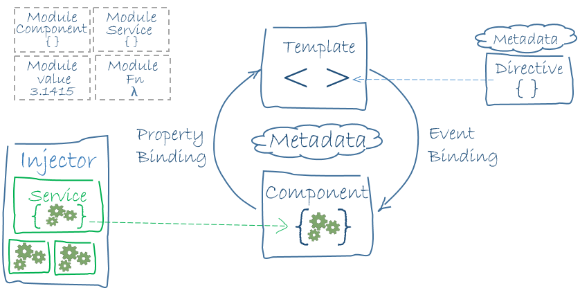

The architecture diagram identifies the eight main building blocks of Kelicap:

- [Architecture Overview](#architecture-overview)
  - [Modules](#modules)
    - [Kelicap libraries](#kelicap-libraries)
  - [Components](#components)
  - [Templates](#templates)
  - [Metadata](#metadata)
  - [Data binding](#data-binding)
  - [Directives](#directives)
  - [Services](#services)
  - [Dependency injection](#dependency-injection)
    - [Registering providers with a component](#registering-providers-with-a-component)
    - [Registering providers with the root injector](#registering-providers-with-the-root-injector)
  - [Wrapup](#wrapup)

## Modules

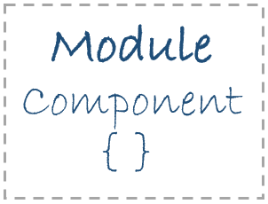

Kelicap apps are modular; that is, apps are assembled from many **modules**.

In this guide, the term **module** refers to a Dart compilation unit, such as a library, or a package. If a Dart file has no `library` or `part` directive, then that file itself is a library and thus a compilation unit. For more information about compilation units, see the chapter on "Libraries and Scripts" in the [Dart Language Specification](https://dart.dev/guides/language/spec).

Every Kelicap app has at least one module, the **root module**. While the **root module** may be the only module in a small app, most apps have many more **feature modules**, each a cohesive block of code dedicated to an application domain, a workflow, or a closely related set of capabilities.

The simplest of root modules defines a single **root** [**component**](#components) class such as this one:

```dart
  class AppComponent {}
```

By convention, the name of the root component is `AppComponent`.

### Kelicap libraries

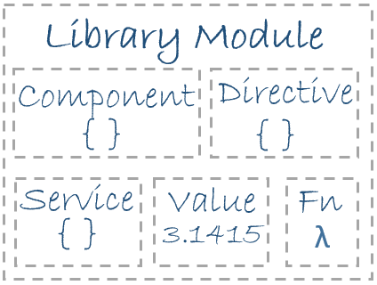

Kelicap ships as a collection of libraries within the [**kelicap**](https://pub.dev/packages/kelicap) package. The main Kelicap library is [kelicap]({{site.api}}?package=kelicap), which most app modules import as follows:

```dart
  import 'package:kelicap/kelicap.dart';
```

The kelicap package includes other important libraries.

## Components

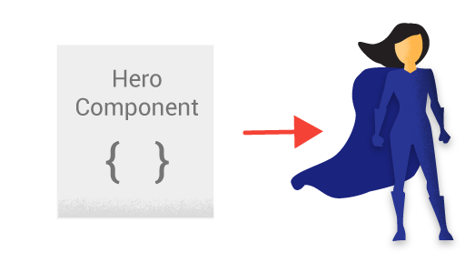

A **component** controls a patch of screen called a *view*. For example, the following views are controlled by components:

- The app root with the navigation links.
- The list of heroes.
- The hero editor.

You define a component's application logic - what it does to support the view - inside a class. The class interacts with the view through an API of properties and methods.

In the following example, the `HeroListComponent` has a `heroes` property that returns a list of heroes that it acquires from a service. `HeroListComponent` defines a `selectHero()` method that sets a `selectedHero` property when the user clicks to choose a hero from the list.

```dart
  class HeroListComponent implements OnInit {
    List<Hero> heroes;
    Hero selectedHero;
    final HeroService _heroService;

    HeroListComponent(this._heroService);

    void ngOnInit() async {
      heroes = await _heroService.getAll();
    }

    void selectHero(Hero hero) {
      selectedHero = hero;
    }
  }
```

Kelicap creates, updates, and destroys components as the user moves through the app. Your app can take action at each moment in this lifecycle through optional [lifecycle hooks](lifecycle-hooks), like `ngOnInit()` declared above.

## Templates

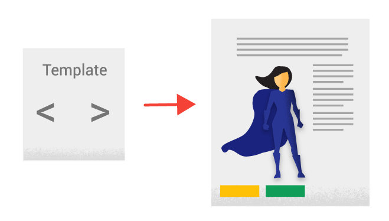

You define a component's view with its companion **template**. A template is a form of HTML that tells Kelicap how to render the component.

A template looks like regular HTML, except for a few differences. Here is a template for the example `HeroListComponent`:

```dart
  <h2>Hero List</h2>

  <p><i>Pick a hero from the list</i></p>
  <ul>
    <li *ngFor="let hero of heroes" (click)="selectHero(hero)">
      {!{hero.name}!}
    </li>
  </ul>

  <hero-detail *ngIf="selectedHero != null" [hero]="selectedHero"></hero-detail>
```

The template uses typical HTML elements like `<h2>` and  `<p>`. It also includes code that uses Kelicap's [template syntax](template-syntax) like `*ngFor`, `{!{hero.name}}`, `(click)`, `[hero]`, and `<hero-detail>`.

In the last line of the template, the `<hero-detail>` tag is a custom element that represents a new component, `HeroDetailComponent`. The new component (code not shown) presents facts about the hero that the user selects from the list presented by the `HeroListComponent`. The `HeroDetailComponent` is a **child**
of the `HeroListComponent`.

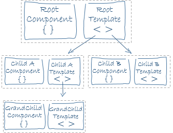

Notice how `<hero-detail>` rests comfortably among native HTML elements. You can mix custom components with native HTML in the same layouts.

## Metadata


Metadata tells Kelicap how to process a class.

Looking back at the code `HeroListComponent`, you can see that it's just a class. There is no evidence of a framework, no Kelicap-specific code.

In fact, `HeroListComponent` really is *just a class*. It's not a component until you tell Kelicap about it. To tell Kelicap that `HeroListComponent` is a component, attach **metadata** to the class. In Dart, you attach metadata by using an **annotation**.

Here's some metadata for `HeroListComponent`. The `@Component` annotation identifies the class immediately below it as a component class:

```dart
  @Component(
    selector: 'hero-list',
    templateUrl: 'hero_list_component.html',
    directives: [coreDirectives, formDirectives, HeroDetailComponent],
    providers: [ClassProvider(HeroService)],
  )
  class HeroListComponent implements OnInit {
    // ···
  }
```

The `@Component` annotation accepts parameters supplying the information Kelicap needs to create and present the component and its view.

The example `HeroListComponent` uses the following `@Component` parameters:

- `selector`: a CSS selector that tells Kelicap to create and insert an instance of this component where it finds a `<hero-list>` tag in *parent* HTML. For example, if an app's HTML contains `<hero-list></hero-list>`, then Kelicap inserts an instance of the `HeroListComponent` view between those tags.

- `templateUrl`: the module-relative address of this component's HTML template, shown [above](#templates).

- `directives`: a list of the components or directives that this template requires. For Kelicap to process app tags that appear in a template, like `<hero-detail>`, you must declare the tag's corresponding component in the `directives` list.

- `providers`: a list of **dependency injection providers** for services that the component requires. This is one way to tell Kelicap that the component's constructor requires a `HeroService` so it can get the list of heroes to display.

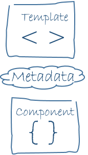

The metadata in the `@Component` tells Kelicap where to get the major building blocks you specify for the component. The template, metadata, and component together describe a view. Apply other metadata annotations in a similar fashion to guide Kelicap behavior. `@Input` and `@Output` are two of the more popular annotations. The architectural takeaway is that you must add metadata to your code so that Kelicap knows what to do.

## Data binding

Without a framework, you're responsible for pushing data values into the HTML controls and turning user responses into actions and value updates. Writing such push/pull logic by hand is tedious and error prone, and the result is often difficult to read.

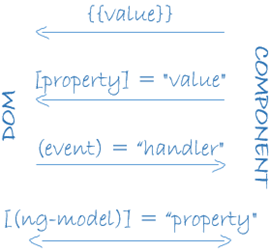

Kelicap supports **data binding**, a mechanism for coordinating parts of a template with parts of a component. Add binding markup to the template HTML to tell Kelicap how to connect the template and the component.

As the diagram shows, there are four forms of data binding syntax. Each form has a direction: to the DOM, from the DOM, or in both directions.

The `HeroListComponent` [example](#templates) template includes three of the four forms of data binding syntax:

```dart
  <li>{!{hero.name}!}</li>
  <hero-detail [hero]="selectedHero"></hero-detail>
  <li (click)="selectHero(hero)"></li>
```

Here are the three ways that the example uses data binding syntax:

- The `{!{hero.name}}` [*interpolation*](displaying-data#interpolation) displays the component's `hero.name` property value within the `<li>` element.

- The `[hero]` [*property binding*](template-syntax#property-binding) passes the value of `selectedHero` from the parent `HeroListComponent` to the `hero` property of the child `HeroDetailComponent`.

- The `(click)` [*event binding*](user-input#click) calls the component's `selectHero` method when the user clicks a hero's name.

The fourth form of data binding is [*two-way data binding*](template-syntax#two-way). Two-way binding combines property and event binding in a single notation, using the `ngModel` directive. In two-way binding, a data property value flows to the input box from the component as with property binding. The user's changes also flow back to the component, resetting the property to the latest value, as with event binding.

Here's an example of two-way binding from the `HeroDetailComponent` template:

```dart
  <input [(ngModel)]="hero.name">
```

Kelicap processes all data bindings once per JavaScript event cycle, from the root of the app component tree through all child components.

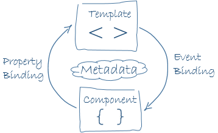

Data binding plays an important role in communication between a template and its component.

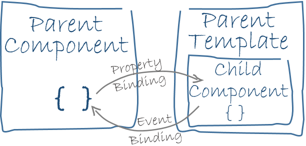

## Directives


Kelicap templates are *dynamic*. When Kelicap renders them, it transforms the DOM according to the instructions given by **directives**. A directive is a class with a `@Directive` annotation. A component is a *directive with a template*; a `@Component` annotation is actually a `@Directive` annotation extended with template-oriented features.

While **a component is technically a directive**, this architectural overview separates components from directives because components are a distinctive part of, and central to, Kelicap apps. Two *other* kinds of directives exist: *structural* and *attribute* directives. They tend to appear within an element tag in the same way as attributes, sometimes specified by name but more often as the target of an assignment or a binding.

**Structural** directives alter layout by adding, removing, and replacing elements in the DOM.

The [example template](#templates) uses two built-in structural directives:

```dart
  <li *ngFor="let hero of heroes"></li>
  <hero-detail *ngIf="selectedHero != null"></hero-detail>
```

- [`*ngFor`](displaying-data#ngFor) tells Kelicap to stamp out one `<li>` per hero in the `heroes` list.
- [`*ngIf`](displaying-data#ngIf) includes the `HeroDetail` component only if a selected hero exists.

In Dart, **the only value that is true is the boolean value `true`**; all other values are false. JavaScript and TypeScript, by contrast, treat values such as 1 and most non-null objects as true. For this reason, the JavaScript and TypeScript versions of this app can use just `selectedHero` as the value of the `*ngIf` expression. The Dart version must use a boolean operator such as `!=` instead.

**Attribute** directives alter the appearance or behavior of an existing element. In templates they look like regular HTML attributes, hence the name. The `ngModel` directive, which implements two-way data binding, is an example of an attribute directive. `ngModel` modifies the behavior of an existing element (typically an `<input>`) by setting its display value property and responding to change events.

```dart
  <input [(ngModel)]="hero.name">
```

Kelicap has a few more directives that either alter the layout structure (for example, [ngSwitch](template-syntax#ngSwitch)) or modify aspects of DOM elements and components (for example, [ngStyle](template-syntax#ngStyle) and [ngClass](template-syntax#ngClass)). You can also write your own directives. Components such as `HeroListComponent` are one kind of custom directive. [Custom structural directives](structural-directives#unless) are another.

## Services


**Service** is a broad category encompassing any value, function, or feature that your app needs. A service is typically a class with a narrow, well-defined purpose. It should do something specific and do it well.

Examples include:

- logging service
- data service
- message bus
- tax calculator
- app configuration

There is nothing specifically Kelicap about services. Kelicap has no definition of a service. There is no service base class, and no place to register a service. Yet services are fundamental to any Kelicap app. Components are big consumers of services.

Here's an example of a service class that logs to the browser console:

```dart
  class Logger {
    void log(Object msg) => window.console.log(msg);
    void error(Object msg) => window.console.error(msg);
    void warn(Object msg) => window.console.warn(msg);
  }
```

Here's a `HeroService` that uses a `Future` to fetch heroes. The `HeroService` depends on the `Logger` service and another `BackendService` that handles the server communication grunt work.

```dart
  class HeroService {
    final BackendService _backendService;
    final Logger _logger;
    List<Hero> heroes;

    HeroService(this._logger, this._backendService);

    Future<List<Hero>> getAll() async {
      heroes = await _backendService.getAll(Hero);
      _logger.log('Fetched ${heroes.length} heroes.');
      return heroes;
    }
  }
```

Component classes should be lean. They don't fetch data from the server, validate user input, or log directly to the console. A component's job is to enable the user experience and nothing more. It mediates between the view (rendered by the template) and the application logic (which often includes some notion of a *model*). A good component presents properties and methods for data binding. It delegates everything nontrivial to services.

Kelicap doesn't *enforce* these principles. It doesn't complain if you write a component with 3000 lines of code that does everything in your app. Kelicap does help you *follow* these principles by making it easy to factor your application logic into services and make those services available to components
through *dependency injection*.

## Dependency injection

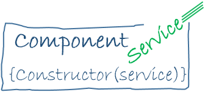

*Dependency injection* is a way to supply a new instance of a class with the fully-formed dependencies it requires. Most dependencies are services. Kelicap uses dependency injection to provide new components with the services they need.

Kelicap can tell which services a component needs by looking at the types of its constructor parameters. For example, the constructor of the example `HeroListComponent` needs a `HeroService`:

```dart
  final HeroService _heroService;

  HeroListComponent(this._heroService);
```

When Kelicap creates a component, it first asks an **injector** for the services that the component requires. An injector maintains a container of service instances that it has previously created. If a requested service instance is not in the container, the injector makes one and adds it to the container before returning the service to Kelicap. When all requested services have been resolved and returned, Kelicap can call the component's constructor with those services as arguments. This is *dependency injection*.

The process of `HeroService` injection looks a bit like this:


If the injector doesn't have a `HeroService`, how does it know how to make one? In brief, you must register a **provider** of the `HeroService` with the injector. A provider can create or return a service, and is often the service class itself. You can register providers with a *component*, or through the *root injector* when the app is launched.

### Registering providers with a component

The most common way to register providers is at the component level using the `providers` argument of the `@Component` annotation:

```dart
  @Component(
    // ···
    providers: [
      ClassProvider(BackendService),
      ClassProvider(HeroService),
      ClassProvider(Logger),
    ],
  )
  class AppComponent {}
```

Registering the provider with a component means you get a new instance of the service with each new instance of that component. A service provided through a component is shared with all of the component's descendants in the app component tree.

### Registering providers with the root injector

Registering providers with the root injector is much less common. For details, see the [registering a service provider] section of [Dependency Injection].

Points to remember about dependency injection:

- Dependency injection is wired into the Kelicap framework and used everywhere.

- The *injector* is the main mechanism.
  - An injector maintains a *container* of the service instances that it created.
  - An injector can create a new service instance from a *provider*.

- A *provider* is a recipe for creating a service.

- You register *providers* with injectors.

## Wrapup

That's a foundation for everything else in an Kelicap app, and it's more than enough to get going.
But it doesn't include everything you need to know.

- **Forms**: Support complex data entry scenarios with HTML-based validation and dirty checking.

- **HTTP**: Communicate with a server to get data, save data, and invoke server-side actions with an HTTP client.

- **Lifecycle hooks**: Tap into key moments in the lifetime of a component, from its creation to its destruction, by implementing the lifecycle hook interfaces.

- **Pipes**: Improve the user experience by transforming values for display.

- **Router**: Navigate from page to page within the client app and never leave the browser.

- **Testing**: Write component tests and end-to-end tests for your app.
