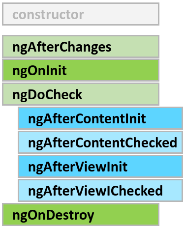
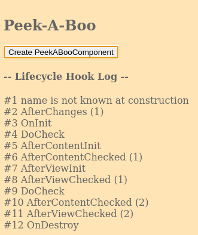
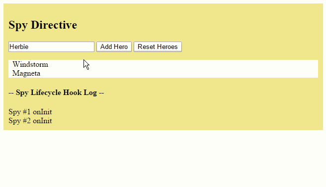
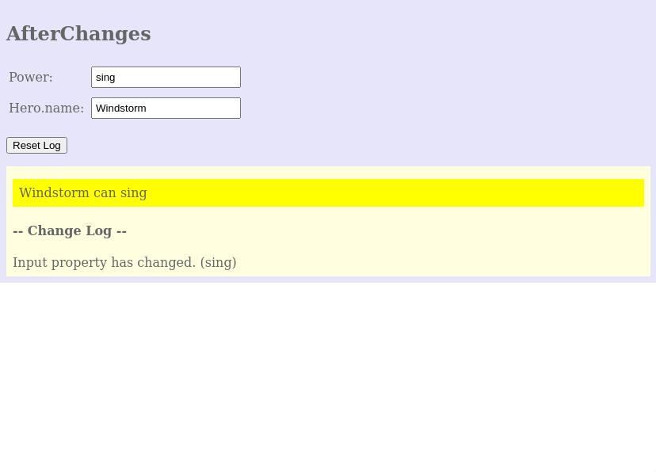
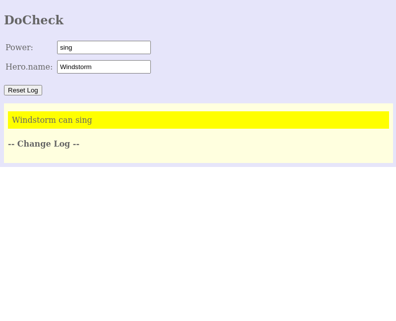
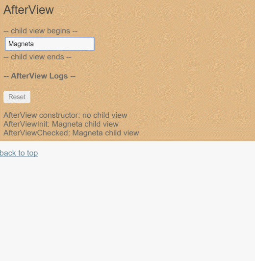
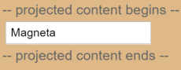

# Lifecycle Hooks

Kelicap calls lifecycle hook methods on directives and components as it creates, changes, and destroys them.



A component has a lifecycle managed by Kelicap itself. Kelicap creates it, renders it, creates and renders its children, checks it when its data-bound properties change, and destroys it before removing it from the DOM. Kelicap offers **lifecycle hooks** that provide visibility into these key life moments and the ability to act when they occur. A directive has the same set of lifecycle hooks, minus the hooks that are specific to component content and views.

## Component lifecycle hooks

Directive and component instances have a lifecycle as Kelicap creates, updates, and destroys them. Developers can tap into key moments in that lifecycle by implementing one or more of the *Lifecycle Hook* interfaces in the Kelicap `core` library.

Each interface has a single hook method whose name is the interface name prefixed with `ng`. For example, the `OnInit` interface has a hook method named `ngOnInit` that Kelicap calls shortly after creating the component:

```dart
  class PeekABoo implements OnInit {
    final LoggerService _logger;

    PeekABoo(this._logger);

    // implement OnInit's `ngOnInit` method
    void ngOnInit() {
      _logIt('OnInit');
    }

    void _logIt(String msg) {
      // Don't tick or else
      // the AfterContentChecked and AfterViewChecked recurse.
      // Let parent call tick()
      _logger.log("#${_nextId++} $msg");
    }
  }
```

No directive or component will implement all of the lifecycle hooks and some of the hooks only make sense for components. Kelicap only calls a directive/component hook method **if it is defined**.

## Lifecycle sequence

After creating a component/directive by calling its constructor, Kelicap calls the lifecycle hook methods in the following sequence at specific moments:

| Hook | Purpose and Timing |
| :--- | :--- |
| **ngAfterChanges** | Respond when Kelicap (re)sets data-bound input properties. Called before `ngOnInit` and whenever one or more data-bound input properties change. |
| **ngOnInit** | Initialize the directive/component after Kelicap first displays the data-bound properties and sets the directive/component's input properties. Called **once**, after the *first* `ngAfterChanges`. |
| **ngDoCheck** | Detect and act upon changes that Kelicap can't or won't detect on its own. Called during every change detection run, immediately after `ngAfterChanges` and `ngOnInit`. |
| **ngAfterContentInit** | Respond after Kelicap projects external content into the component's view. Called *once* after the first `NgDoCheck`. *A component-only hook*. |
| **ngAfterContentChecked** | Respond after Kelicap checks the content projected into the component. Called after the `ngAfterContentInit` and every subsequent `ngDoCheck`. *A component-only hook*. |
| **ngAfterViewInit** | Respond after Kelicap initializes the component's views and child views. Called *once* after the first `ngAfterContentChecked`. *A component-only hook*. |
| **ngAfterViewChecked** | Respond after Kelicap checks the component's views and child views. Called after the `ngAfterViewInit` and every subsequent `ngAfterContentChecked`. *A component-only hook*. |
| **ngOnDestroy** | Cleanup just before Kelicap destroys the directive/component. Unsubscribe observables and detach event handlers to avoid memory leaks. Called *just before* Kelicap destroys the directive/component. |

## Other lifecycle hooks

Other Kelicap sub-systems may have their own lifecycle hooks apart from these component hooks.

The router, for instance, also has its own [router lifecycle hooks](router/5) that allow us to tap into specific moments in route navigation. A parallel can be drawn between `ngOnInit` and `routerOnActivate`. Both are prefixed so as to avoid collision, and both run right when a component is being initialized.

3rd party libraries might implement their hooks as well in order to give developers more control over how these libraries are used.

## Lifecycle exercises

The [example app](https://pub.dev/packages/kelicap/example) demonstrates the lifecycle hooks in action through a series of exercises presented as components under the control of the root `AppComponent`. They follow a common pattern: a *parent* component serves as a test rig for a *child* component that illustrates one or more of the lifecycle hook methods.

Here's a brief description of each exercise:

| Example | Description |
| :--- | :--- |
| **Peek-a-boo** | Demonstrates every lifecycle hook. Each hook method writes to the on-screen log. |
| **Spy** | Directives have lifecycle hooks too. A `SpyDirective` can log when the element it spies upon is created or destroyed using the `ngOnInit` and `ngOnDestroy` hooks. This example applies the `SpyDirective` to a `<div>` in an `ngFor` *hero* repeater managed by the parent `SpyComponent`. |
| **AfterChanges** | See how Kelicap calls the `ngAfterChanges` hook with a `changes` object every time one of the component input properties changes. Shows how to interpret the `changes` object. |
| **DoCheck** | Implements an `ngDoCheck` method with custom change detection. See how often Kelicap calls this hook and watch it post changes to a log. |
| **AfterView** | Shows what Kelicap means by a *view*. Demonstrates the `ngAfterViewInit` and `ngAfterViewChecked` hooks. |
| **AfterContent** | Shows how to project external content into a component and how to distinguish projected content from a component's view children. Demonstrates the `ngAfterContentInit` and `ngAfterContentChecked` hooks. |
| **Counter** | Demonstrates a combination of a component and a directive each with its own hooks. In this example, a `CounterComponent` logs a change (via `ngAfterChanges`) every time the parent component increments its input counter property. Meanwhile, the `SpyDirective` from the previous example is applied to the `CounterComponent`'s host element, logging every one of its lifecycle events, including the `ngDoCheck` event that fires every time the parent's counter changes. |

The remainder of this chapter discusses selected exercises in further detail.

## Peek-a-boo: all hooks

The `PeekABooComponent` demonstrates all of the hooks in one component. You would rarely, if ever, implement all of the interfaces like this. The peek-a-boo exists to show how Kelicap calls the hooks in the expected order. The following snapshot reflects the state of the log after the user clicked the *Create...* button and then the *Destroy...* button.



The sequence of log messages follows the prescribed hook calling order: `AfterChanges`, `OnInit`, `DoCheck`&nbsp;(3x), `AfterContentInit`, `AfterContentChecked`&nbsp;(3x), `AfterViewInit`, `AfterViewChecked`&nbsp;(3x), and `OnDestroy`. The constructor isn't a Kelicap hook *per se*. The log confirms that input properties (the `name` property in this case) have no assigned values at construction. Had the user clicked the *Update Hero* button, the log would show another `AfterChanges` and two more triplets of `DoCheck`, `AfterContentChecked` and `AfterViewChecked`. Clearly these three hooks fire a *often*. Keep the logic in these hooks as lean as possible!

The next examples focus on hook details.

## Spying *OnInit* and *OnDestroy*

Go undercover with these two spy hooks to discover when an element is initialized or destroyed. This is the perfect infiltration job for a directive. The heroes will never know they're being watched. Kidding aside, pay attention to two key points:

1. Kelicap calls hook methods for *directives* as well as components.

2. A spy directive can provide insight into a DOM object that you cannot change directly.

Obviously you can't touch the implementation of a native `div`. You can't modify a third party component either. But you can watch both with a directive. The sneaky spy directive is simple, consisting almost entirely of `ngOnInit` and `ngOnDestroy` hooks that log messages to the parent via an injected `LoggerService`.

```dart
  // Spy on any element to which it is applied.
  // Usage: <div mySpy>...</div>
  @Directive(selector: '[mySpy]')
  class SpyDirective implements OnInit, OnDestroy {
    final LoggerService _logger;

    SpyDirective(this._logger);

    @override
    void ngOnInit() => _logIt('onInit');

    @override
    void ngOnDestroy() => _logIt('onDestroy');

    _logIt(String msg) => _logger.log('Spy #${_nextId++} $msg');
  }
```

You can apply the spy to any native or component element and it'll be initialized and destroyed at the same time as that element. Here it is attached to the repeated hero `<div>`

```html
  <div *ngFor="let hero of heroes" mySpy class="heroes">
    {!{hero}!}
  </div>
```

Each spy's birth and death marks the birth and death of the attached hero `<div>` with an entry in the *Hook Log* as seen here:



Adding a hero results in a new hero `<div>`. The spy's `ngOnInit` logs that event. The *Reset* button clears the `heroes` list. Kelicap removes all hero `<div>` elements from the DOM and destroys their spy directives at the same time. The spy's `ngOnDestroy` method reports its last moments. The `ngOnInit` and `ngOnDestroy` methods have more vital roles to play in real apps.

### OnInit

Use `ngOnInit` for two main reasons:

1. to perform complex initializations shortly after construction
1. to set up the component after Kelicap sets the input properties

Experienced developers agree that components should be cheap and safe to construct. Don't fetch data in a component constructor. You shouldn't worry that a new component will try to contact a remote server when created under test or before you decide to display it. Constructors should do no more than set the initial local variables to simple values.

An `ngOnInit` is a good place for a component to fetch its initial data. Remember also that a directive's data-bound input properties are not set until **after construction**. That's a problem if you need to initialize the directive based on those properties. They'll have been set when `ngOninit` runs.

Note that the `ngAfterChanges` method is your first opportunity to access those properties. Kelicap calls `ngAfterChanges` before `ngOnInit` ... and many times after that. It only calls `ngOnInit` once. You can count on Kelicap to call the `ngOnInit` method `soon` after creating the component.
That's where the heavy initialization logic belongs.

### OnDestroy

Put cleanup logic in `ngOnDestroy`, the logic that **must** run before Kelicap destroys the directive. This is the time to notify another part of the app that the component is going away. This is the place to free resources that won't be garbage collected automatically. Unsubscribe from observables and DOM events. Stop interval timers. Unregister all callbacks that this directive registered with global or app services.
You risk memory leaks if you neglect to do so.

## AfterChanges

Kelicap calls its `ngAfterChanges` method whenever it detects changes to **input properties** of the component (or directive). This example monitors the `AfterChanges` hook.

```dart
  ngAfterChanges() {
    changeLog.add('Input property has changed. ($power)');
  }
```

The example component, `AfterChangesComponent`, has two input properties: `hero` and `power`.

```dart
  @Input()
  Hero? hero;
  @Input()
  String power = '';
```

The host `AfterChangesParentComponent` binds to them like this:

```html
  <after-changes [hero]="hero" [power]="power"></after-changes>
```

Here's the sample in action as the user makes changes.



The log entry appear as the string value of the *power* property changes.
But the `ngAfterChanges` does not catch changes to `hero.name`. That's surprising at first! Kelicap only calls the hook when the value of the input property changes. The value of the `hero` property is the **reference to the hero object**. Kelicap doesn't care that the hero's own `name` property changed.The hero object *reference* didn't change so, from Kelicap's perspective, there is no change to report!

## DoCheck

Use the `DoCheck` hook to detect and act upon changes that Kelicap doesn't catch on its own. The `DoCheck` sample extends the *AfterChanges* sample with the following `ngDoCheck` hook:

```dart
  ngDoCheck() {
    final heroName = hero?.name ?? '';
    if (heroName != oldHeroName) {
      changeDetected = true;
      changeLog.add(
          'DoCheck: Hero name changed to "${heroName}" from "$oldHeroName"');
      oldHeroName = heroName;
    }

    if (power != oldPower) {
      changeDetected = true;
      changeLog.add('DoCheck: Power changed to "$power" from "$oldPower"');
      oldPower = power;
    }

    if (changeDetected) {
      noChangeCount = 0;
    } else {
      // log that hook was called when there was no relevant change.
      var count = noChangeCount += 1;
      var noChangeMsg =
          'DoCheck called ${count}x when no change to hero or power';
      if (count == 1) {
        // add "no change" message
        changeLog.add(noChangeMsg);
      } else {
        // update last "no change" message
        changeLog[changeLog.length - 1] = noChangeMsg;
      }
    }

    changeDetected = false;
  }
```

This code inspects certain **values-of-interest**, capturing and comparing their current state against previous values. It writes a special message to the log when there are no substantive changes to the `hero` or the `power`
so you can see how often `DoCheck` is called. The results are illuminating:



While the `ngDoCheck` hook can detect when the hero's `name` has changed, it has a frightful cost. This hook is called with enormous frequency after **every** change detection cycle no matter where the change occurred. It's called over twenty times in this example before the user can do anything.

Most of these initial checks are triggered by Kelicap's first rendering of **unrelated data elsewhere on the page**. Mere mousing into another input box triggers a call. Relatively few calls reveal actual changes to pertinent data. Clearly our implementation must be very lightweight or the user experience will suffer.

## AfterView

The *AfterView* sample explores the `AfterViewInit` and `AfterViewChecked` hooks that Kelicap calls **after** it creates a component's child views.Here's a child view that displays a hero's name in an input box:

```dart
  @Component(
    selector: 'my-child-view',
    template: '<input [(ngModel)]="hero">',
    directives: [coreDirectives, formDirectives],
  )
  class ChildViewComponent {
    String hero = 'Magneta';
  }
```

The `AfterViewComponent` displays this child view *within its template*:

```dart
  template: '''
    <div>-- child view begins --</div>
      <my-child-view></my-child-view>
    <div>-- child view ends --</div>
    <p *ngIf="comment.isNotEmpty" class="comment">{!{comment}!}</p>''',
```

The following hooks take action based on changing values **within the child view** which can only be reached by querying for the child view via the property decorated with `@ViewChild`.

```dart
  class AfterViewComponent implements AfterViewChecked, AfterViewInit {
    String? _prevHero = '';

    // Query for a VIEW child of type `ChildViewComponent`
    @ViewChild(ChildViewComponent)
    ChildViewComponent? viewChild;

    ngAfterViewInit() {
      // viewChild is set after the view has been initialized
      _logIt('AfterViewInit');
      _doSomething();
    }

    ngAfterViewChecked() {
      // viewChild is updated after the view has been checked
      if (_prevHero == viewChild?.hero) {
        _logIt('AfterViewChecked (no change)');
      } else {
        _prevHero = viewChild?.hero;
        _logIt('AfterViewChecked');
        _doSomething();
      }
    }
  }
```

### Abide by the unidirectional data flow rule

The `doSomething` method updates the screen when the hero name exceeds 10 characters.

```dart
  // This surrogate for real business logic sets the `comment`
  void _doSomething() {
    var length = viewChild?.hero.length ?? 0;
    var c = length > 10 ? "That's a long name" : '';
    if (c != comment) {
      // Wait a tick because the component's view has already been checked
      _logger.tick().then((_) {
        comment = c;
      });
    }
  }
```

Why does the `doSomething` method wait a tick before updating `comment`?

Kelicap's unidirectional data flow rule forbids updates to the view **after** it has been composed. Both of these hooks fire **after** the component's view has been composed. Kelicap throws an error if the hook updates the component's data-bound `comment` property immediately (try it!). The `LoggerService.tick()` postpones the log update for one turn of the browser's update cycle ... and that's just long enough.

Here's *AfterView* in action



Notice that Kelicap frequently calls `AfterViewChecked`, often when there are no changes of interest. Write lean hook methods to avoid performance problems.

## AfterContent

The *AfterContent* sample explores the `AfterContentInit` and `AfterContentChecked` hooks that Kelicap calls **after** Kelicap projects external content into the component.

### Content projection

*Content projection* is a way to import HTML content from outside the component and insert that content into the component's template in a designated spot. Consider this variation on the previous **AfterView** example. This time, instead of including the child view within the template, it imports the content from the `AfterContentComponent`'s parent. Here's the parent's template.

```dart
  template: '''
    <div class="parent">
      <h2>AfterContent</h2>

      <div *ngIf="show">
        <after-content>
          <my-child></my-child>
        </after-content>
      </div>

      <h4>-- AfterContent Logs --</h4>
      <p><button (click)="reset()">Reset</button></p>
      <div *ngFor="let msg of logs">{!{msg}!}</div>
    </div>
    ''',
```

Notice that the `<my-child>` tag is tucked between the `<after-content>` tags. Never put content between a component's element tags **unless you intend to project that content into the component**.

Now look at the component's template:

```dart
  template: '''
    <div>-- projected content begins --</div>
      <ng-content></ng-content>
    <div>-- projected content ends --</div>
    <p *ngIf="comment.isNotEmpty" class="comment">{!{comment}!}</p>
    ''',
```

The `<ng-content>` tag is a *placeholder* for the external content.
It tells Kelicap where to insert that content. In this case, the projected content is the `<my-child>` from the parent.



The tell-tale signs of *content projection* are:

- HTML between component element tags and
- the presence of `<ng-content>` tags in the component's template.

### AfterContent hooks

**AfterContent** hooks are similar to the *AfterView* hooks. The key difference is in the child component

- The *AfterView* hooks concern `ViewChildren`, the child components whose element tags
appear *within* the component's template.

- The *AfterContent* hooks concern `ContentChildren`, the child components that Kelicap
projected into the component.

The following *AfterContent* hooks take action based on changing values in a **content child** which can only be reached by querying for it via the property decorated with `@ContentChild`

```dart
  class AfterContentComponent implements AfterContentChecked, AfterContentInit {
    String? _prevHero = '';
    String comment = '';

    // Query for a CONTENT child of type `ChildComponent`
    @ContentChild(ChildComponent)
    ChildComponent? contentChild;

    ngAfterContentInit() {
      // contentChild is set after the content has been initialized
      _logIt('AfterContentInit');
      _doSomething();
    }

    ngAfterContentChecked() {
      // contentChild is updated after the content has been checked
      if (_prevHero == contentChild?.hero) {
        _logIt('AfterContentChecked (no change)');
      } else {
        _prevHero = contentChild?.hero;
        _logIt('AfterContentChecked');
        _doSomething();
      }
    }
  }
```

### No unidirectional flow worries with *AfterContent...*

This component's `doSomething` method update's the component's data-bound `comment` property immediately. There's no need to wait. Recall that Kelicap calls both **AfterContent** hooks before calling either of the **AfterView** hooks. Kelicap completes composition of the projected content **before** finishing the composition of this component's view. There is a small window between the `AfterContent...` and `AfterView...` hooks to modify the host view.
