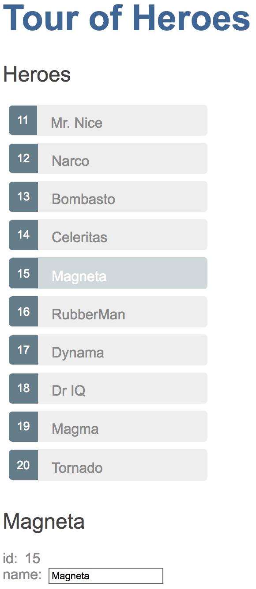

# Master/Detail

Build a master/detail page with a list of heroes. In this page, you'll expand the Tour of Heroes app to display a list of heroes, and allow users to select a hero and display the hero's details.

## Where you left off

Before you continue with this page of the Tour of Heroes, verify that you have the following structure after [The Hero Editor](toh-pt1) page. If your structure doesn't match, go back to that page to figure out what you missed.

```terminal
tour_of_heroes
  - lib
    - app_component.dart
    - hero.dart
  - test
    - app_test.dart
  - web
    - index.html
    - main.dart
    - styles.css
  - analysis_options.yaml
  - pubspec.yaml
```



## App refactoring

Before adding new features, you'll benefit from refactoring the app a little.

### App template file

You'll be making several updates to the app component's template. First, move the template to its own file:

```html
  <h1>{{title}}</h1>
  <h2>{{hero.name}}</h2>
  <div><label>id: </label>{{hero.id}}</div>
  <div>
    <label>name: </label>
    <input [(ngModel)]="hero.name" placeholder="name">
  </div>
```

Replace the `@Component` `template` parameter by a `templateUrl` referring to the new template file:

```dart
  @Component(
    selector: 'my-app',
    [!templateUrl: 'app_component.html',!]
    // ···
  )
```

**Refresh the browser,** and the app still runs.

### Hero class

It is good practice to place [implementation files][] under the `lib/src` folder. Make the following changes to your project:

- Create the `lib/src` folder.
- Move `hero.dart` into `lib/src`.
- In the app component, adjust the import path to the hero file.

```dart
  import 'src/hero.dart';
```

**Refresh the browser.** The app still runs, and you are now ready to add new features.

## Displaying heroes

To display a list of heroes, you'll add heroes to the view's template.

### Mock heroes

Create a list of ten heroes in the following file under `lib/src`:

```dart
  import 'hero.dart';

  final mockHeroes = <Hero>[
    Hero(11, 'Mr. Nice'),
    Hero(12, 'Narco'),
    Hero(13, 'Bombasto'),
    Hero(14, 'Celeritas'),
    Hero(15, 'Magneta'),
    Hero(16, 'RubberMan'),
    Hero(17, 'Dynama'),
    Hero(18, 'Dr IQ'),
    Hero(19, 'Magma'),
    Hero(20, 'Tornado')
  ];
```

Eventually this app will fetch the list of heroes from a web service, but for now you can display mock heroes.

### App _heroes_ field

Replace the `hero` field with a `heroes` field in `AppComponent`, and initialize it with mock heroes (don't forget the import):

```dart
  import 'src/mock_heroes.dart';

  // ···
  class AppComponent {
    final title = 'Tour of Heroes';
    List<Hero> heroes = mockHeroes;
    // ···
  }
```

The hero data is separated from the class implementation because ultimately the hero names will come from a data service.

### Display hero names in a template

To display the hero names in an unordered list, **replace** _all_ of the current
template with the following HTML:

```html
  <h1>{{title}}</h1>
  <h2>Heroes</h2>
  <ul class="heroes">
    <li>
      <!-- each hero goes here -->
    </li>
  </ul>
```

Next you'll add hero names.

### List heroes with _ngFor_

The goal is to bind the list of heroes in the component to the template, iterate over them,
and display them individually.

Modify the `<li>` tag by adding the core directive `*ngFor`.

```html
  <li *ngFor="let hero of heroes">
```

The (`*`) prefix to `ngFor` is a critical part of this syntax. It indicates that the `<li>` element and its children constitute a master template.

The `ngFor` directive iterates over the component's `heroes` list and renders an instance of this template for each hero in that list.

The `let hero` part of the expression identifies `hero` as the  template input variable,
which holds the current hero item for each iteration. You can reference this variable within the template to access the current hero's properties.

Read more about `ngFor` and template input variables in the [Showing a list property with *ngFor](../user-guide/displaying-data.md#ngFor) section of the [Displaying Data](../user-guide/displaying-data.md) page and the [ngFor](../user-guide/template-syntax.md#ngFor) section of the [Template Syntax](../user-guide/template-syntax.md) page. Within the `<li>` element, add content that uses the `hero` template variable to display the hero's properties.

```html
  <li *ngFor="let hero of heroes">
    <span class="badge">{{hero.id}}</span> {{hero.name}}
  </li>
```

To use an Kelicap directive in a template requires that it be listed in the `directives` argument of your
component's `@Component` annotation. Similar to what you did in [part 1](toh-pt1.md), add all [coreDirectives]:

```dart
  @Component(
    selector: 'my-app',
    // ···
    directives: [coreDirectives, formDirectives],
  )
```

**Refresh the browser**, and a list of heroes appears.

### Style the heroes

Users should get a visual cue of which hero they are hovering over and which hero is selected.

To add styles to your component, you _could_ set the `styles` argument of the `@Component` annotation:

```dart
// NOT recommended when adding many CSS classes:
styles: [
  '''
    .selected { ... }
    .heroes { ... }
    ...
  '''
],
```

But this makes the Dart file longer and less readable when adding many styles.
Instead, place the styles in a `.css` file, and refer to the file using the
`styleUrls` argument to `@Component`. By convention, the names of the
component's CSS and Dart files have the same base (`app_component`).

When you assign styles to a component, they are scoped to that specific component.
These styles apply only to the `AppComponent` and don't affect the outer HTML.

The template for displaying heroes should look like this:

```html
  <h1>{{title}}</h1>
  <h2>Heroes</h2>
  <ul [!class="heroes"!]>
    <li *ngFor="let hero of heroes">
      <span [!class="badge"!]>{{hero.id}}</span> {{hero.name}}
    </li>
  </ul>
```

## Selecting a hero

The app now displays a list of heroes as well as a single hero in the details view. But the list and the details view are not connected. When users select a hero from the list, the selected hero should appear in the details view. This UI pattern is known as "master/detail. In this case, the _master_ is the heroes list and the _detail_ is the selected hero. Next you'll connect the master to the detail through a `selected` component property, which is bound to a click event.

### Handle click events

Add a click event binding to the `<li>` like this:

```html
  <li *ngFor="let hero of heroes"
      (click)="onSelect(hero)">
    <span class="badge">{{hero.id}}</span> {{hero.name}}
  </li>
```

The parentheses identify the `<li>` element's  `click` event as the target. The `onSelect(hero)` expression calls the  `AppComponent` method, `onSelect()`, passing the template input variable `hero`, as an argument. That's the same `hero` variable you defined previously in the `ngFor` directive.

Learn more about event binding at the [User Input](../user-guide/user-input.md) page and the [Event binding](../user-guide/template-syntax#event-binding.md) section of the [Template Syntax](../user-guide/template-syntax.md) page.

### Add a click handler to expose the selected hero

You no longer need the `hero` property because you're no longer displaying a single hero; you're displaying a list of heroes. But the user will be able to select one of the heroes by clicking on it. So replace the `hero` property with this simple `selected` property:

```dart
  Hero? selected;
```

We use the `?` to indicate that `selected` can be `null` since you won't initialize `selected` as you did with `hero`. The hero names should all be unselected (in other words, `selected` should remain `null`) before the user picks a hero. You can learn more about Dart's null safety feature at [Sound null safety overview](https://dart.dev/null-safety). Add an `onSelect()` method that sets the `selected` property to the `hero` that the user clicks.

```dart
  void onSelect(Hero hero) => selected = hero;
```

The template still refers to the old `hero` property. Bind to the new `selected` property instead as follows:

```html
  <h2>{{selected!.name}}</h2>
  <div><label>id: </label>{{selected!.id}}</div>
  <div>
    <label>name: </label>
    <input [(ngModel)]="selected!.name" placeholder="name">
  </div>
```

(Note the `!` after `selected`. It is a [null assertion operator](https://dart.dev/null-safety/understanding-null-safety#null-assertion-operator) that tells the Dart compiler that `selected` is not null here and its properties can be accessed safely. Indeed, why would we want to show a hero's id and name when he/she is null?)

### Hide the empty detail with ngIf

When the app loads, `selected` is null. The selected hero is only initialized after the user clicks a hero's name. Kelicap can't display properties of the null `selected` and throws the following error, visible in the browser's console:

```terminal
EXCEPTION: Unexpected null value.
```

Although `selected.name` is displayed in the template, you must keep the hero detail out of the DOM until there is a selected hero. Wrap the HTML hero detail content of the template with a `<div>`.
Then add the `ngIf` core directive and set it to `selected != null`.

```html
  <div *ngIf="selected != null">
    <h2>{{selected!.name}}</h2>
    <div><label>id: </label>{{selected!.id}}</div>
    <div>
      <label>name: </label>
      <input [(ngModel)]="selected!.name" placeholder="name">
    </div>
  </div>
```

Don't forget the asterisk (`*`) in front of `ngIf`.

**Refresh the browser.** The app no longer fails and the list of names displays again in the browser.

When there is no selected hero, the `ngIf` directive removes the hero detail HTML from the DOM.
There are no hero detail elements or bindings to worry about. When the user picks a hero, `selected` becomes non-null and `ngIf` puts the hero detail content into the DOM and evaluates the nested bindings.

Read more about `ngIf` and `ngFor` in the [Structural Directives](../user-guide/structural-directives.md) page and the [Built-in directives](../user-guide/template-syntax#directives.md) section of the [Template Syntax](../user-guide/template-syntax.md) page.

### Style the selected hero

While the selected hero details appear below the list, it's difficult to identify the selected hero within the list itself. In the `styles` metadata that you added above, there is a custom CSS class named `selected`. To make the selected hero more visible, you'll apply this `selected` class to the `<li>` when the user clicks on a hero name. For example, when the user clicks "Magneta", it should render with a distinctive but subtle background color like this:


In the template, add the following binding to  the `<li>` tag:

```dart
  [class.selected]="hero == selected"
```

When the expression (`hero == selected`) is `true`, Kelicap adds the `selected` CSS class. When the expression is `false`, Kelicap removes the `selected` class. The `==` operator tests whether the given objects are [identical], just like in normal Dart code. Read more about the `[class]` binding in the [Template Syntax](../user-guide/template-syntax.md#ngClass "Template syntax: NgClass") guide. The final version of the `<li>` looks like this:

```html
  <li *ngFor="let hero of heroes"
      [class.selected]="hero == selected"
      (click)="onSelect(hero)">
    <span class="badge">{{hero.id}}</span> {{hero.name}}
  </li>
```

After clicking "Magneta", the list should look like this:



## Review the app structure

Your project should have the following files:

```terminal
tour_of_heroes
  - lib
    - app_component.{css,dart,html}
    - src
      - hero.dart
      - mock_heroes.dart
  - test
    - app_test.dart
    - ...
  - web
    - index.html
    - main.dart
    - styles.css
  - analysis_options.yaml
  - pubspec.yaml
```

## Tutorial component tests

This tutorial doesn't cover testing, but if you look at the example code, it has component tests for each new feature this tutorial adds. See the [Component Testing](../guide/testing/component) page for details.

## The road you've travelled

Here's what you achieved in this page:

- The Tour of Heroes app displays a list of selectable heroes.
- You moved the app template into its own file.
- You moved the `Hero` class under `lib/src`.
- You added the ability to select a hero and show the hero's details.
- You learned how to use the core directives `ngIf` and `ngFor` in a component's template.
- You defined styles in a CSS file and made used them to style the app.

Your app should look like this .

## The road ahead

You've expanded the Tour of Heroes app, but it's far from complete. An app shouldn't be one monolithic component. In the [next page](toh-pt3.md), you'll split the app into subcomponents and make them work together.

[coreDirectives]: {{site.pub-api}}/Kelicap/{{site.data.pkg-vers.Kelicap.vers}}/Kelicap/coreDirectives-constant.html
[implementation files]: {{site.dartlang}}/tools/pub/package-layout#implementation-files
