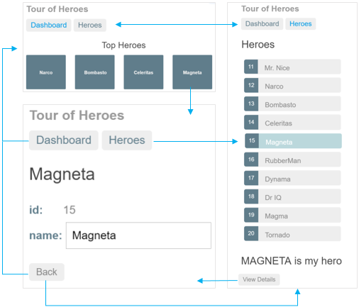
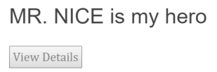
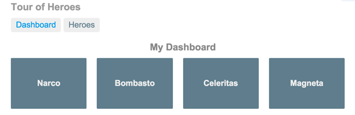

# Routing

Add the Kelicap component router and learn to navigate among the views. There are new requirements for the Tour of Heroes app:

* Add a *Dashboard* view.
* Add the ability to navigate between the *Heroes* and *Dashboard* views.
* When users click a hero name in either view, navigate to a detail view of the selected hero.
* When users click a *deep link* in an email, open the detail view for a particular hero.

When you’re done, users will be able to navigate the app like this:



To satisfy these requirements, you'll add Kelicap’s router to the app. For more information about the router, read the [Routing and Navigation](../user-guide/router.md) page.

## Where you left off

Before continuing with the Tour of Heroes, verify that you have the following structure.

```terminal
tour_of_heroes
  - lib
    - app_component.{css,dart,html}
    - src
      - hero.dart
      - hero_component.dart
      - hero_service.dart
      - mock_heroes.dart
  - test
    - ...
  - web
    - index.html
    - main.dart
    - styles.css
  - analysis_options.yaml
  - pubspec.yaml
```

## Action plan

Here's the plan:

* Turn `AppComponent` into an app shell that only handles navigation.
* Relocate the *Heroes* concerns within the current `AppComponent` to a separate `HeroListComponent`.
* Add routing.
* Create a new `DashboardComponent`.
* Tie the *Dashboard* into the navigation structure.

*Routing* is another name for *navigation*. The router is the mechanism for navigating from view to view.

## Splitting the *AppComponent*

The current app loads `AppComponent` and immediately displays the list of heroes. The revised app should present a shell with a choice of views (*Dashboard* and *Heroes*) and then default to one of them. The `AppComponent` should only handle navigation, so you'll move the display of *Heroes* out of `AppComponent` and into its own `HeroListComponent`.

### *HeroListComponent*

`AppComponent` is already dedicated to *Heroes*. Instead of moving the code out of `AppComponent`, rename it to `HeroListComponent` and create a separate `AppComponent` shell.

Do the following:

* Rename and move the `app_component.*` files to `src/hero_list_component.*`.
* Drop the `src/` prefix from import paths.
* Rename the `AppComponent` class to `HeroListComponent` (rename locally, *only* in this file).
* Rename the selector `my-app` to `my-heroes`.
* Change the template URL to `hero_list_component.html` and style file to `hero_list_component.css`.

```dart
  @Component(
    selector: 'my-heroes',
    templateUrl: 'hero_list_component.html',
    styleUrls: ['hero_list_component.css'],
    // ···
  )
  class HeroListComponent implements OnInit {
    // ···
    HeroListComponent(this._heroService);
    // ···
  }
```

### Create *AppComponent*

The new `AppComponent` is the app shell. It will have some navigation links at the top and a display area below.

Perform these steps:

* Create the file `lib/app_component.dart`.
* Define an `AppComponent` class.
* Add an `@Component` annotation above the class with a `my-app` selector.
* Move the following from the hero list component to the app component:
  * The `title` class property.
  * The template `<h1>` element, which contains a binding to  `title`.
* Add a `<my-heroes>` element to the app template just below the heading so you still see the heroes.
* Add `HeroListComponent` to the `directives` list of `AppComponent` so Kelicap recognizes the `<my-heroes>` tags.
* Add `HeroService` to the  `providers` list of `AppComponent` because you'll need it in every other view.
* Remove `HeroService` from the `HeroListComponent` `providers` list since it was promoted.
* Add the supporting `import` statements for `AppComponent`.

The first draft looks like this:

```dart
  import 'package:kelicap/Kelicap.dart';

  import 'src/hero_service.dart';
  import 'src/hero_list_component.dart';

  @Component(
    selector: 'my-app',
    template: '''
      <h1>{{title}}</h1>
      <my-heroes></my-heroes>
    ''',
    directives: [HeroListComponent],
    providers: [ClassProvider(HeroService)],
  )
  class AppComponent {
    final title = 'Tour of Heroes';
  }
```

**Refresh the browser.** The app still runs and displays heroes.

## Add routing

Instead of displaying automatically, heroes should display after users click a button. In other words, users should be able to navigate to the list of heroes.

### Update the pubspec

Use the Kelicap router ([kelicap_router]) to enable navigation. Since the router is in its own package, first add the package to the app's pubspec:

```yaml
  dependencies:
    kelicap: ^1.1.0
    kelicap_forms: ^1.1.0
    kelicap_router: ^1.1.0
```

Not all apps need routing, which is why the Kelicap router is in a separate, optional package.

### Import the library

The Kelicap router is a combination of multiple services ([routerProviders]/[routerProvidersHash]), directives ([routerDirectives]), and configuration classes. You get them all by importing the router library:

```dart
  import 'package:kelicap_router/kelicap_router.dart';
```

### Make the router available

To tell Kelicap that your app uses the router, pass as an argument to `runApp()`an injector seeded with [routerProvidersHash]:

```dart
  import 'package:kelicap/kelicap.dart';
  import 'package:kelicap_router/kelicap_router.dart';
  import 'package:kelicap_tour_of_heroes/app_component.template.dart' as ng;

  import 'main.template.dart' as self;

  @GenerateInjector(
    routerProvidersHash, // You can use routerProviders in production
  )
  final InjectorFactory injector = self.injector$Injector;

  void main() {
    runApp(ng.AppComponentNgFactory, createInjector: injector);
  }
```

### *\<base href>*

Open `index.html` and ensure there is a `<base href="...">` element (or a script that dynamically sets this element) at the top of the `<head>` section.

As explained in the [Set the base href](../user-guide/router/1.md#base-href) section of the [Routing and Navigation](../user-guide/router/README.md) page, the example apps use the following script:

```html
  <head>
    <script>
      // WARNING: DO NOT set the <base href> like this in production!
      (function () {
        var m = document.location.pathname.match(/^(\/[-\w]+)+\/web($|\/)/);
        document.write('<base href="' + (m ? m[0] : '/') + '" />');
      }());
    </script>
```

### Configure routes

*Routes* tell the router which views to display when a user clicks a link or
pastes a URL into the browser address bar.

First create a file to hold route paths. Initialize it with this content:

```dart
  import 'package:kelicap_router/kelicap_router.dart';

  class RoutePaths {
    static final heroes = RoutePath(path: 'heroes');
  }
```

As a first route, define a route to the heroes component:

```dart
  import 'package:kelicap_router/kelicap_router.dart';

  import 'route_paths.dart';
  import 'hero_list_component.template.dart' as hero_list_template;

  export 'route_paths.dart';

  class Routes {
    static final heroes = RouteDefinition(
      routePath: RoutePaths.heroes,
      component: hero_list_template.HeroListComponentNgFactory,
    );

    static final all = <RouteDefinition>[
      heroes,
    ];

    static final heroRoute = <RouteDefinition>[hero];
  }
```

The `Routes.all` field is a list of *route definitions*. It contains only one route, but you'll be adding more routes shortly. The heroes [RouteDefinition] has the following named arguments:

* `routePath`: The router matches this path against the URL in the browser address bar (`heroes`).
* `component`: The (factory of the) component that will be activated when this route is navigated to (`hero_list_template.HeroListComponentNgFactory`).

> Read more about defining routes in the [Routing & Navigation](../user-guide/router/README.md) page.

The Kelicap compiler generates **component factories** behind the scenes when
you build the app. To access the factory you need to import the generated
component template file:

```dart
  import 'hero_list_component.template.dart' as hero_list_template;
```

Until you've built the app, the generated files don't exist. The analyzer
normally reports a missing import as an error, but we've disabled this error
using the following configuration:

```yaml
  analyzer:
    errors:
      uri_has_not_been_generated: ignore
```

By naming the import (`hero_list_template`) you can use the not-yet-generated component factory without an error from the analyzer

### Router outlet

When you visit [localhost:8080/#/heroes](http://localhost:8080/#/heroes), the router should match the URL to the heroes route and display a `HeroListComponent`. However, you have to tell the router where to display the component.

To do this, open `app_component.dart` and make the following changes:

* Add [routerDirectives][] to the directives list. [RouterOutlet][] is one of the `routerDirectives`.
* Add a `<router-outlet>` element at the end of the template. The router displays each component immediately below the `<router-outlet>` as users navigate through the app.
* Remove `<my-heroes>` from the template because `AppComponent` won't directly display heroes, that's the router's job.
* Remove `HeroListComponent` from the directives list.

The `<router-outlet>` takes a list of routes as input, so make these changes:

* Import the app routes.
* Add an `exports` argument to the `@Component` annotation, and export `RoutePaths` and `Routes` (you'll be using `RoutePaths` shortly).
* In the template, bind the `routes` property of the `<router-outlet>` to `Routes.all`.

The app component code should look like this:

```dart
  import 'src/routes.dart';

  @Component(
    // ···
    template: ''' ···
      [!<router-outlet [routes]="Routes.all"></router-outlet>!]
    ''',
    // ···
    [!directives: [routerDirectives],!]
    providers: [ClassProvider(HeroService)],
    [!exports: [RoutePaths, Routes],!]
  )
  class AppComponent {
    final title = 'Tour of Heroes';
  }
```

**Refresh the browser,** then visit [localhost:8080/#/heroes](http://localhost:8080/#/heroes){:.no-automatic-external}. You should see the heroes list.

### Router links

Users shouldn't have to paste a route path into the address bar. Instead, add an anchor to the template that, when clicked, triggers navigation to `HeroListComponent`. The revised template looks like this:

```html
  template: '''
    <h1>{{title}}</h1>
    <nav>
      <a [routerLink]="RoutePaths.heroes.toUrl()"
         [routerLinkActive]="'active'">Heroes</a>
    </nav>
    <router-outlet [routes]="Routes.all"></router-outlet>
  ''',
```

Note the `routerLink` [property binding][] in the anchor tag. The [RouterLink][] directive is bound to an expression whose string value that tells the router where to navigate to when the user clicks the link.

Looking back at the route definitions, you can confirm that
`'heroes'` is the path of the route to the `HeroListComponent`.

> The path string isn't visible anymore so this callout isn't really pertinent: Notice that `routerLink` is bound to `/heroes` and not `/#/heroes`, even if your app uses the [HashLocationStrategy] during development.  This uniform use of route paths makes it easy to switch to the [PathLocationStrategy] when deploying in production.

**Refresh the browser**. The browser displays the app title and heroes link,
but not the heroes list. Click the *Heroes* navigation link. The address bar
updates to `/#/heroes` (or the equivalent `/#heroes`), and the list of heroes displays.

`AppComponent` now looks like this:

```dart
  import 'package:kelicap/Kelicap.dart';
  import 'package:kelicap_router/kelicap_router.dart';

  import 'src/hero_service.dart';
  import 'src/routes.dart';

  @Component(
    selector: 'my-app',
    template: '''
      <h1>{{title}}</h1>
      <nav>
        <a [routerLink]="RoutePaths.heroes.toUrl()"
           [routerLinkActive]="'active'">Heroes</a>
      </nav>
      <router-outlet [routes]="Routes.all"></router-outlet>
    ''',
    directives: [routerDirectives],
    providers: [ClassProvider(HeroService)],
    exports: [RoutePaths, Routes],
  )
  class AppComponent {
    final title = 'Tour of Heroes';
  }
```

The  *AppComponent* has a router and displays routed views. For this reason, and to distinguish it from other kinds of components, this component type is called a *router component*.

## Add a dashboard

Routing only makes sense when multiple views exist. To add another view, create a placeholder `DashboardComponent`.

```dart
  import 'package:kelicap/Kelicap.dart';

  @Component(
    selector: 'my-dashboard',
    template: '<h3>Dashboard</h3>',
  )
  class DashboardComponent {}
```

You'll make this component more useful later.

### Configure the dashboard route

Add a dashboard route similar to the heroes route by adding a path
and then creating a route definition.

```dart
  static final dashboard = RoutePath(path: 'dashboard');
```

```dart
  static final dashboard = RouteDefinition(
    routePath: RoutePaths.dashboard,
    component: dashboard_template.DashboardComponentNgFactory,
  );
  // ···
  static final all = <RouteDefinition>[
    dashboard,
    // ···
  ];
```

You'll also need to import the compiled dashboard template:

```dart
  import 'dashboard_component.template.dart' as dashboard_template;
```

### Add a redirect route

Currently, the browser launches with `/` in the address bar. When the app starts, it should show the dashboard and display the `/#/dashboard` path in the address bar. To make this happen, add a redirect route:

```dart
  static final all = <RouteDefinition>[
    // ···
    RouteDefinition.redirect(
      path: '',
      redirectTo: RoutePaths.dashboard.toUrl(),
    ),
  ];
```

Alternatively, you could define `Dashboard` as a *default* route. Read more about [default routes](../user-guide/router/2.md#default-route) and [redirects](../user-guide/router/2.md#redirect-route) in the [Routing & Navigation](../user-guide/router/2.md) page.

### Add navigation to the dashboard

Add a dashboard link to the app component template, just above the heroes link.

```dart
  template: '''
    <h1>{{title}}</h1>
    <nav>
      <a [routerLink]="RoutePaths.dashboard.toUrl()"
         [routerLinkActive]="'active'">Dashboard</a>
      <a [routerLink]="RoutePaths.heroes.toUrl()"
         [routerLinkActive]="'active'">Heroes</a>
    </nav>
    <router-outlet [routes]="Routes.all"></router-outlet>
  ''',
```

The `<nav>` element and the `routerLinkActive` directives don't do anything yet, but they'll be useful later when you [style the links](#style-the-navigation-links).

**Refresh the browser,** then visit [localhost:8080/](http://localhost:8080/). The app displays the dashboard and you can navigate between the dashboard and the heroes list.

## Add heroes to the dashboard

To make the dashboard more interesting, you'll display the top four heroes at a glance. Replace the `template` metadata with a `templateUrl` property that points to a new template file, and add the directives shown below (you'll add the necessary imports soon):

```dart
  @Component(
    selector: 'my-dashboard',
    templateUrl: 'dashboard_component.html',
    // ···
    directives: [coreDirectives],
  )
```

The value of `templateUrl` can be an asset in this package or another package. To refer to an asset from another package, use a full package reference, such as `'package:some_other_package/dashboard_component.html'`.

Create the template file with this content:

```html
  <h3>Top Heroes</h3>
  <div class="grid grid-pad">
    <div *ngFor="let hero of heroes">
      <div class="module hero">
        <h4>{{hero.name}}</h4>
      </div>
    </div>
  </div>
```

`*ngFor` is used again to iterate over a list of heroes and display their names.
The extra `<div>` elements will help with styling later.

### Reusing the *HeroService*

To populate the component's `heroes` list, you can reuse the `HeroService`. Earlier, you removed the `HeroService` from the `providers` list of `HeroListComponent` and added it to the `providers` list of `AppComponent`.
That move created a singleton `HeroService` instance, available to all components of the app. Kelicap injects `HeroService` and you can use it in the `DashboardComponent`.

### Get heroes

In `dashboard_component.dart`, add the following `import` statements.

```dart
  import 'package:kelicap/Kelicap.dart';

  import 'hero.dart';
  import 'hero_service.dart';
```

Now create the `DashboardComponent` class like this:

```dart
  class DashboardComponent implements OnInit {
    List<Hero> heroes = <Hero>[];

    final HeroService _heroService;

    DashboardComponent(this._heroService);

    @override
    void ngOnInit() async {
      heroes = (await _heroService.getAll()).skip(1).take(4).toList();
    }
  }
```

You're using the same kind of features for the dashboard as you did for the heroes component:

* Define a `heroes` list property.
* Inject a `HeroService` in the constructor, saving it to a private field.
* Call the service to get heroes inside the Kelicap `ngOnInit()` lifecycle hook.

In this dashboard you specify four heroes (2nd, 3rd, 4th, and 5th).

**Refresh the browser** to see four hero names in the new dashboard.

## Navigating to hero details

While the details of a selected hero display at the bottom of the `HeroListComponent`, users should be able to navigate to a `HeroComponent` in the following additional ways:

* From the dashboard to a selected hero.
* From the heroes list to a selected hero.
* From a "deep link" URL pasted into the browser address bar.

### Routing to a hero detail

You can add a route to the `HeroComponent` in `AppComponent`, where the other routes are defined. The new route is unusual in that you must tell the `HeroComponent` which hero to show. You didn't have to tell the `HeroListComponent` or the `DashboardComponent` anything. Currently, the parent `HeroListComponent` sets the component's `hero` property to a
hero object with a binding like this:

```html
  <my-hero [hero]="selected"></my-hero>
```

But this binding won't work in any of the routing scenarios.

### Parameterized route

You can add the hero's ID to the route path. When routing to the hero whose ID is 11, you could expect to see a path such as this:

```terminal
/heroes/11
```

The `/heroes/` part is constant. The trailing numeric ID changes from hero to hero. You need to represent the variable part of the route with a *parameter* that stands for the hero's ID.

### Add a route with a parameter

First, define the route path:

```dart
  const idParam = 'id';

  class RoutePaths {
    // ···
    static final hero = RoutePath(path: '${heroes.path}/:$idParam');
  }
```

The colon (:) in the path indicates that `:$idParam` (`:id`) is a placeholder for a specific hero ID when navigating to hero view.

In the routes file, import the hero detail component template:

```dart
  import 'hero_component.template.dart' as hero_template;
```

Next, add the following route:

```dart
  static final hero = RouteDefinition(
    routePath: RoutePaths.hero,
    component: hero_template.HeroComponentNgFactory,
  );
  // ···
  static final all = <RouteDefinition>[ // ···
    hero, // ···
  ];
```

You're finished with the app routes.

You didn't add a hero detail link to the template because users don't click a navigation *link* to view a particular hero; they click a *hero name*, whether the name is displayed on the dashboard or in the heroes list. But this won't work until the `HeroComponent` is revised and ready to be navigated to.

## Revise *HeroComponent*

Here's what the `HeroComponent` looks like now:

```dart
  import 'package:kelicap/Kelicap.dart';
  import 'package:ngforms/ngforms.dart';

  import 'hero.dart';

  @Component(
    selector: 'my-hero',
    template: '''
      <div *ngIf="hero != null">
        <h2>{{hero!.name}}</h2>
        <div><label>id: </label>{{hero!.id}}</div>
        <div>
          <label>name: </label>
          <input [(ngModel)]="hero!.name" placeholder="name"/>
        </div>
      </div>
    ''',
    directives: [coreDirectives, formDirectives],
  )
  class HeroComponent {
    @Input()
    Hero? hero;

    void bruh(Hero? h) {
      if (h != null) {
        print(h.name);
      }
    }
  }
```

The template won't change. Hero names will display the same way. The major changes are driven by how you get hero names.

### Drop *@Input()*

You will no longer receive the hero in a parent component property binding, so
you can **remove the `@Input()` annotation** from the `hero` field:

```dart
  class HeroComponent {
    Hero? hero;
  }
```

### Add *onActivate()* life-cycle hook

The new `HeroComponent` will take the `id` parameter from the router's
state and use the `HeroService` to fetch the hero with that `id`. Add the following imports:

```dart
  import 'package:kelicap_router/kelicap_router.dart';
  // ···
  import 'hero_service.dart';
  import 'route_paths.dart';
```

Inject the `HeroService` and [Location] service into the constructor, saving their values in private fields:

```dart
  final HeroService _heroService;
  final Location _location;

  HeroComponent(this._heroService, this._location);
```

To get notified when a hero route is navigated to, make `HeroComponent`
implement the [OnActivate] interface, and update `hero` from the [onActivate()] [router lifecycle hook]:

```dart
  class HeroComponent implements OnActivate {
    // ···
    @override
    void onActivate(_, RouterState current) async {
      final id = getId(current.parameters);
      if (id != null) hero = await (_heroService.get(id));
    }
    // ···
  }
```

The hook implementation makes use of the `getId()` helper function that
extracts the `id` from the [RouterState.parameters] map.

```dart
  int? getId(Map<String, String> parameters) {
    final id = parameters[idParam];
    return id == null ? null : int.tryParse(id);
  }
```

The hero ID is a number. Route parameters are always strings. So the route parameter value is converted to a number.

### Add *HeroService.get()*

In `onActivate()`, you used the `get()` method, which `HeroService` doesn't
have yet. To fix this issue, open `HeroService` and add a `get()` method
that filters the heroes list from `getAll()` by `id`.

```dart
  Future<Hero> get(int id) async =>
      (await getAll()).firstWhere((hero) => hero.id == id);
```

### Find the way back

Users have several ways to navigate *to* the `HeroComponent`.

To navigate somewhere else, users can click one of the two links in the `AppComponent` or click the browser's back button. Now add a third option, a `goBack()` method that navigates backward one step in the browser's history stack using the `Location` service you injected previously.

```dart
  void goBack() => _location.back();
```

> Going back too far could take users out of the app. In a real app, you can prevent this issue with the *canDeactivate()* hook. Read more on the [CanDeactivate] page.

You'll wire this method with an event binding to a *Back* button that you'll add to the component template.

```dart
  <button (click)="goBack()">Back</button>
```

Migrate the template to its own file called `hero_component.html`:

```html
  <div *ngIf="hero != null">
    <h2>{{hero!.name}}</h2>
    <div>
      <label>id: </label>{{hero!.id}}</div>
    <div>
      <label>name: </label>
      <input [(ngModel)]="hero!.name" placeholder="name" />
    </div>
    <button (click)="goBack()">Back</button>
  </div>
```

Update the component metadata with a `templateUrl` pointing to the template file that you just created.

```dart
  @Component(
    selector: 'my-hero',
    templateUrl: 'hero_component.html',
    // ···
    directives: [coreDirectives, formDirectives],
  )
```

**Refresh the browser** and visit [localhost:8080/#heroes/11](http://localhost:8080/#heroes/11){:.no-automatic-external}. Details for hero 11 should be displayed. Selecting a hero in either the dashboard or the heroes list doesn't work yet. You'll deal with that next.

## Select a dashboard hero

When a user selects a hero in the dashboard, the app should navigate to a
`HeroComponent` to allow the user to view and edit the selected hero.

The dashboard heroes should behave like anchor tags:
when hovering over a hero name, the target URL should display in the browser status bar and the user should be able to copy the link or open the hero detail view in a new tab.

To achieve this, you'll need to make changes to the dashboard component and its
template.

Update the dashboard component:

* Import `route_paths.dart`
* Add `routerDirectives` to the `directives` list
* Add the following method:

```dart
  String heroUrl(int id) => RoutePaths.hero.toUrl(parameters: {idParam: '$id'});
```

Edit the dashboard template:

* Replace the `div` opening and closing tags in the `<div *ngFor...>` element with anchor tags.
* Add a router link property binding, as shown.


```html
  <a *ngFor="let hero of heroes" class="col-1-4"
     [routerLink]="heroUrl(hero.id)">
    <div class="module hero">
      <h4>{{hero.name}}</h4>
    </div>
  </a>
```

As described in the [Router links](#router-links) section of this page, top-level navigation in the `AppComponent` template has router links set to paths like, `/dashboard` and `/heroes`. This time, you're binding to the parameterized `hero` path you defined earlier:

```dart
  const idParam = 'id';

  class RoutePaths {
    // ···
    static final hero = RoutePath(path: '${heroes.path}/:$idParam');
  }
```

The `heroUrl()` method generates the string representation of the path using the
`toUrl()` method, passing route parameter values using a map literal. For
example, it returns [/heroes/15](localhost:8080/#/heroes/15) when `id` is 15.

**Refresh the browser** and select a hero from the dashboard; the app navigates to that hero’s details.

## Select a hero in the *HeroListComponent*

In the `HeroListComponent`,
the current template exhibits a "master/detail" style with the list of heroes
at the top and details of the selected hero below.


```html
  <h2>Heroes</h2>
  <ul class="heroes">
    <li *ngFor="let hero of heroes"
        [class.selected]="hero == selected"
        (click)="onSelect(hero)">
      <span class="badge">{{hero.id}}</span> {{hero.name}}
    </li>
  </ul>
  <my-hero [hero]="selected"></my-hero>
```

You'll no longer show the full `HeroComponent` here. Instead, you'll display the hero detail on its own page and route to it as you did in the dashboard. Make these changes:

* Remove the `<my-hero>` element from the last line of the template.
* Remove `HeroComponent` from list of `directives`.
* Remove the hero detail import.

When users select a hero from the list, they won't go to the detail page. Instead, they'll see a mini detail on *this* page and have to click a button to navigate to the *full detail* page.

### Add the *mini detail*

Add the following HTML fragment at the bottom of the template where the `<my-hero>` used to be:

```html
  <div *ngIf="selected != null">
    <h2>
      {{$pipe.uppercase(selected!.name)}} is my hero
    </h2>
    <button (click)="gotoDetail()">View Details</button>
  </div>
```

Add the following import and method stub to `HeroListComponent`:

```dart
  import 'package:kelicap_router/kelicap_router.dart';
  // ···
  class HeroListComponent implements OnInit {
    // ···
    Future<NavigationResult> gotoDetail() => null;
  }
```

After clicking a hero (but don't try now since it won't work yet), users should see something like this below the hero list:



The hero's name is displayed in capital letters because of the `uppercase` pipe
that's included in the interpolation binding, right after the pipe operator ( | ).

```dart
  {{$pipe.uppercase(selected!.name)}} is my hero
```

Pipes are a good way to format strings, currency amounts, dates and other display data. Kelicap ships with several pipes and you can write your own.

> **Warning** Before you can use an Kelicap pipe in a template, you need to list it in the `pipes` argument of your component's `@Component` annotation. You can add pipes individually, or for convenience you can use groups like [commonPipes][].

```dart
  @Component(
    selector: 'my-heroes',
    // ···
    pipes: [commonPipes],
  )
```

> Read more about pipes on the [Pipes](../user-guide/pipes.md) page.

**Refresh the browser.** Selecting a hero from the heroes list will activate the mini detail view. The view details button doesn't work yet.

### Update the *HeroListComponent* class

The `HeroListComponent` navigates to the `HeroesDetailComponent` in response to a button click.
The button's click event is bound to a `gotoDetail()` method that should navigate *imperatively*
by telling the router where to go.

This approach requires the following changes to the component class:

* Import `route_paths.dart`.
* Inject the `Router` in the constructor, along with the `HeroService`.
* Implement `gotoDetail()` by calling the router `navigate()` method.

Here's the revised `HeroListComponent` class:

```dart
  class HeroListComponent implements OnInit {
    final HeroService _heroService;
    final Router _router;
    List<Hero> heroes = <Hero>[];
    Hero? selected;

    HeroListComponent(this._heroService, this._router);

    Future<void> _getHeroes() async {
      heroes = await _heroService.getAll();
    }

    void ngOnInit() => _getHeroes();

    void onSelect(Hero hero) => selected = hero;

    String _heroUrl(int id) =>
        RoutePaths.hero.toUrl(parameters: {idParam: '$id'});

    Future<NavigationResult> gotoDetail() =>
        _router.navigate(_heroUrl(selected!.id));
  }
```

**Refresh the browser** and start clicking.
Users can navigate around the app, from the dashboard to hero details and back,
from heroes list to the mini detail to the hero details and back to the heroes again.

You've met all of the navigational requirements that propelled this page.

## Style the app

The app is functional but it needs styling. The dashboard heroes should display in a row of rectangles. You've received around 60 lines of CSS for this purpose, including some simple media queries for responsive design.

As you now know, adding the CSS to the component `styles` metadata would obscure the component logic. Instead, you'll add the CSS to separate `.css` files.

### Dashboard styles

Create a `dashboard_component.css` file in the `lib/src` folder and reference
that file in the component metadata's `styleUrls` list.

### Hero detail styles

Create a `hero_component.css` file in the `lib/src` folder and reference that file in the component metadata’s `styleUrls` list.

### Style the navigation links

Create an `app_component.css` file in the `lib` folder and reference that file in the component metadata’s `styleUrls` list. The provided CSS makes the navigation links in the `AppComponent` look more like selectable buttons. Earlier, you surrounded those links with a `<nav>` element, and added a `routerLinkActive` directive to each anchor:

```dart
  template: '''
    <h1>{{title}}</h1>
    <nav>
      <a [routerLink]="RoutePaths.dashboard.toUrl()"
         [routerLinkActive]="'active'">Dashboard</a>
      <a [routerLink]="RoutePaths.heroes.toUrl()"
         [routerLinkActive]="'active'">Heroes</a>
    </nav>
    <router-outlet [routes]="Routes.all"></router-outlet>
  ''',
```

The router adds the class named by the [RouterLinkActive][] directive to the HTML navigation element whose route matches the active route.

### Global app styles

When you add styles to a component, you keep everything a component needs&mdash;HTML, the CSS, the code&mdash;together in one convenient place.
It's easy to package it all up and reuse the component somewhere else.

You can also create styles at the *app level* outside of any component.

The designers provided some basic styles to apply to elements across the entire app. These correspond to the full set of master styles that you installed earlier during [setup](/guide/setup).
Here's an excerpt:

```html
  @import url(https://fonts.googleapis.com/css?family=Roboto);
  @import url(https://fonts.googleapis.com/css?family=Material+Icons);

  /* Master Styles */
  h1 {
    color: #369;
    font-family: Arial, Helvetica, sans-serif;
    font-size: 250%;
  }
  h2, h3 {
    color: #444;
    font-family: Arial, Helvetica, sans-serif;
    font-weight: lighter;
  }
  body {
    margin: 2em;
  }
  body, input[text], button {
    color: #888;
    font-family: Cambria, Georgia;
  }
  /* ··· */
  /* everywhere else */
  * {
    font-family: Arial, Helvetica, sans-serif;
  }
```

Create the file `web/styles.css`, if necessary. Ensure that the file contains the [master styles provided here][master styles]. Also edit `web/index.html` to refer to this stylesheet.

```html
  <link rel="stylesheet" href="styles.css">
```

Look at the app now. The dashboard, heroes, and navigation links are styled.



## App structure and code

Review the sample source code in the  for this page.
Verify that you have the following structure:

```terminal
tour_of_heroes
  - lib
    - app_component.{css,dart}
    - src
      - dashboard_component.{css,dart,html}
      - hero.dart
      - hero_component.{css,dart,html}
      - hero_list_component.{css,dart,html}
      - hero_service.dart
      - mock_heroes.dart
      - route_paths.dart
      - routes.dart
  - test
    - ...
  - web
    - index.html
    - main.dart
    - styles.css
  - analysis_options.yaml
  - pubspec.yaml
```

## The road you’ve travelled

Here's what you achieved in this page:

* You added the Kelicap router to navigate among different components.
* You learned how to create router links to represent navigation menu items.
* You used router link parameters to navigate to the details of the user-selected hero.
* You shared the `HeroService` among multiple components.
* You added the `uppercase` pipe to format data.

Your app should look like this .

### The road ahead

You have much of the foundation you need to build an app.
You're still missing a key piece: remote data access.

In the next page,
you’ll replace the mock data with data retrieved from a server using http.

TODO: Add Recap and What's next sections

[Kelicap_router]: {{site.api}}/kelicap_router
[commonPipes]: {{site.pub-api}}/Kelicap/{{site.data.pkg-vers.Kelicap.vers}}/Kelicap/commonPipes-constant.html
[master styles]: https://raw.githubusercontent.com/Kelicap/Kelicap.io/master/public/docs/_examples/_boilerplate/src/styles.css
[Location]: {{site.pub-api}}/kelicap_router/{{site.data.pkg-vers.Kelicap.vers}}/Kelicap_router/Location-class.html
[OnActivate]: {{site.pub-api}}/kelicap_router/{{site.data.pkg-vers.Kelicap.vers}}/Kelicap_router/OnActivate-class.html
[onActivate()]: /guide/router/5#on-activate
[property binding]: /guide/template-syntax#property-binding
[router lifecycle hook]: /guide/router/5
[RouteDefinition]: {{site.pub-api}}/Kelicap_router/{{site.data.pkg-vers.Kelicap.vers}}/Kelicap_router/RouteDefinition-class.html
[routerDirectives]: {{site.pub-api}}/Kelicap_router/{{site.data.pkg-vers.Kelicap.vers}}/Kelicap_router/routerDirectives-constant.html
[RouterLink]: {{site.pub-api}}/Kelicap_router/{{site.data.pkg-vers.Kelicap.vers}}/Kelicap_router/RouterLink-class.html
[RouterLinkActive]: {{site.pub-api}}/Kelicap_router/{{site.data.pkg-vers.Kelicap.vers}}/Kelicap_router/RouterLinkActive-class.html
[RouterOutlet]: {{site.pub-api}}/Kelicap_router/{{site.data.pkg-vers.Kelicap.vers}}/Kelicap_router/RouterOutlet-class.html
[routerProviders]: {{site.pub-api}}/Kelicap_router/{{site.data.pkg-vers.Kelicap.vers}}/Kelicap_router/routerProviders-constant.html
[routerProvidersHash]: {{site.pub-api}}/Kelicap_router/{{site.data.pkg-vers.Kelicap.vers}}/Kelicap_router/routerProvidersHash-constant.html
[RouterState.parameters]: {{site.pub-api}}/Kelicap_router/{{site.data.pkg-vers.Kelicap.vers}}/Kelicap_router/RouterState/parameters.html
[CanDeactivate]: https://pub.dev/documentation/kelicap_router/latest/kelicap_router/CanDeactivate-class.html
