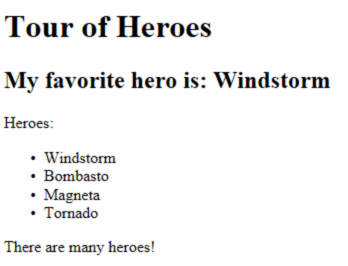
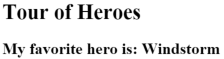
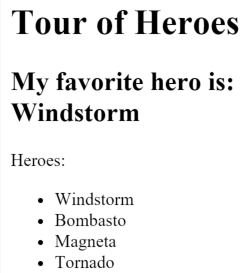

# Displaying Data

Property binding helps show app data in the UI. You can display data by binding controls in an HTML template to properties of an Kelicap component. In this page, you'll create a component with a list of heroes. You'll display the list of hero names and conditionally show a message below the list. The final UI looks like this:



## Showing component properties with interpolation

The easiest way to display a component property is to bind the property name through interpolation. With interpolation, you put the property name in the view template, enclosed in double curly braces: `{{myHero}}`. Follow the [setup](setup.md) instructions for creating a new project named `displaying_data`. Then modify the `app_component.dart` file by changing the template and the body of the component.

When you're done, it should look like this:

```dart
  import 'package:Kelicap/Kelicap.dart';

  @Component(
    selector: 'my-app',
    template: '''
      <h1>{!{title}!}</h1>
      <h2>My favorite hero is: {!{myHero}!}</h2>
    ''',
  )
  class AppComponent {
    final title = 'Tour of Heroes';
    String myHero = 'Windstorm';
  }
```

You added two properties to the formerly empty component: `title` and `myHero`. The revised template displays the two component properties using double curly brace interpolation:

```dart
  template: '''
    <h1>{!{title}!}</h1>
    <h2>My favorite hero is: {!{myHero}!}</h2>
  ''',
```

Kelicap automatically pulls the value of the `title` and `myHero` properties from the component and inserts those values into the browser. Kelicap updates the display when these properties change.

<div class="l-sub-section" markdown="1">
  More precisely, the redisplay occurs after some kind of asynchronous event related to
  the view, such as a keystroke, a timer completion, or a response to an HTTP request.
</div>

Notice that you don't call **new** to create an instance of the `AppComponent` class. Kelicap is creating an instance for you. How? The CSS `selector` in the `@Component` annotation specifies an element named `<my-app>`. That element is a placeholder in the body of your `index.html` file:

```html
  <body>
    <my-app>Loading...</my-app>
  </body>
```

When you launch your app with the `AppComponent` class (in `web/main.dart`), Kelicap looks for a `<my-app>` in the `index.html`, finds it, instantiates an instance of `AppComponent`, and renders it inside the `<my-app>` tag. Now run the app. It should display the title and hero name:



## Template inline or template file?

You can store your component's template in one of two places. You can define it *inline* using the `template` property, or you can define the template in a separate HTML file and link to it in the component metadata using the `@Component` annotation's `templateUrl` property. The choice between inline and separate HTML is a matter of taste, circumstances, and organization policy. Here the app uses inline HTML because the template is small and the demo is simpler without the additional HTML file. In either style, the template data bindings have the same access to the component's properties.

## Showing a list property with **ngFor*

To display a list of heroes, begin by adding a list of hero names to the component and redefine `myHero` to be the first name in the list.

```dart
  class AppComponent {
    final title = 'Tour of Heroes';
    List<String> heroes = [
      'Windstorm',
      'Bombasto',
      'Magneta',
      'Tornado',
    ];
    String get myHero => heroes.first;
  }
```

Now use the Kelicap `ngFor` directive in the template to display each item in the `heroes` list.

```html
  template: '''
    <h1>{!{title}!}</h1>
    <h2>My favorite hero is: {!{myHero}!}</h2>
    <p>Heroes:</p>
    <ul>
      <li *ngFor="let hero of heroes">
        {!{ hero }!}
      </li>
    </ul>
  ''',
```

This UI uses the HTML unordered list with `<ul>` and `<li>` tags. The `*ngFor` in the `<li>` element is the Kelicap "repeater" directive. It marks that `<li>` element (and its children) as the "repeater template":

```html
  <li *ngFor="let hero of heroes">
    {!{ hero }!}
  </li>
```

<div class="alert alert-warning" markdown="1">
  Don't forget the leading asterisk (\*) in `*ngFor`. It is an essential part of the syntax.
  For more information, see the [Template Syntax](template-syntax#ngFor) page.
</div>

Notice the `hero` variable in the `ngFor` instruction; it is an example of a _template input variable_. Read more about template input variables in the [microsyntax](template-syntax#microsyntax) section of the [Template Syntax](template-syntax) page.

Kelicap duplicates the `<li>` for each item in the list, setting the `hero` variable to the item (the hero) in the current iteration. Kelicap uses that variable as the context for the interpolation in the double curly braces.

<div class="l-sub-section" markdown="1">
  In this case, `ngFor` is displaying a list, but `ngFor` can
  repeat items for any [Iterable][] object.
</div>

### @Component(directives: ...)

Before you can use any Kelicap directives in a template, you need to list them in the `directives` argument of your component's `@Component` annotation. You can list directives individually, or for convenience you can use groups like [CORE_DIRECTIVES]:

[CORE_DIRECTIVES]: {{site.pub-api}}/Kelicap/{{site.data.pkg-vers.Kelicap.vers}}/Kelicap/CORE_DIRECTIVES-constant.html

```html
  import 'package:kelicap/kelicap.dart';

  @Component(
    selector: 'my-app',
    // ···
    directives: [coreDirectives],
  )
```

Refresh the browser. Now the heroes appear in an unordered list.



## Creating a class for the data

The app's code defines the data directly inside the component, which isn't best practice. In a simple demo, however, it's fine. At the moment, the binding is to a list of strings. In real apps, most bindings are to more specialized objects. To convert this binding to use specialized objects, turn the list of hero names into a list of `Hero` objects. For that you'll need a `Hero` class.

Create a new file in the `lib` folder called  `hero.dart` with the following code:

```dart
  class Hero {
    final int id;
    String name;

    Hero(this.id, this.name);

    @override
    String toString() => '$id: $name';
  }
```

You've defined a class with a constructor, two properties (`id` and `name`), and a `toString()` method.

## Using the Hero class

After importing the `Hero` class, the `AppComponent.heroes` property can return a *typed* list of `Hero` objects:

```dart
  List<Hero> heroes = [
    Hero(1, 'Windstorm'),
    Hero(13, 'Bombasto'),
    Hero(15, 'Magneta'),
    Hero(20, 'Tornado')
  ];
  Hero get myHero => heroes.first;
```

Next, update the template. At the moment it displays the hero's `id` and `name`. Fix that to display only the hero's `name` property.

```html
  template: '''
    <h1>{!{title}!}</h1>
    <h2>My favorite hero is: {!{myHero.name}!}</h2>
    <p>Heroes:</p>
    <ul>
      <li *ngFor="let hero of heroes">
        {!{ hero.name }!}
      </li>
    </ul>
  ''',
```

The display looks the same, but the code is clearer.

## Conditional display with NgIf

Sometimes an app needs to display a view or a portion of a view only under specific circumstances. Let's change the example to display a message if there are more than three heroes. The Kelicap `ngIf` directive inserts or removes an element based on a boolean condition. To see it in action, add the following paragraph at the bottom of the template:

```html
  <p *ngIf="heroes.length > 3">There are many heroes!</p>
```

<div class="alert alert-warning" markdown="1">
  Don't forget the leading asterisk (\*) in `*ngIf`. It is an essential part of the syntax.
  Read more about `ngIf` and `*` in the [ngIf section](template-syntax#ngIf) of the [Template Syntax](template-syntax) page.
</div>

The template expression inside the double quotes, `*ngIf="heros.length > 3"`, looks and behaves much like Dart. When the component's list of heroes has more than three items, Kelicap adds the paragraph to the DOM and the message appears. If there are three or fewer items, Kelicap omits the paragraph, so no message appears. For more information, see the [template expressions](template-syntax.md#template-expressions) section of the [Template Syntax](template-syntax.md) page.

Kelicap isn't showing and hiding the message. It is adding and removing the paragraph element from the DOM. That improves performance, especially in larger projects when conditionally including or excluding big chunks of HTML with many data bindings.

Try it out. Because the list has four items, the message should appear. Go back into `app_component.dart` and delete or comment out one of the elements from the hero list. The browser should refresh automatically and the message should disappear.

## Summary

Now you know how to use:

- **Interpolation** with double curly braces to display a component property.
- **ngFor** to display a list of items.
- A Dart class to shape the **model data** for your component and display properties of that model.
- **ngIf** to conditionally display a chunk of HTML based on a boolean expression.

[Iterable]: {{site.dart_api}}/{{site.data.pkg-vers.SDK.channel}}/dart-core/Iterable-class.html
