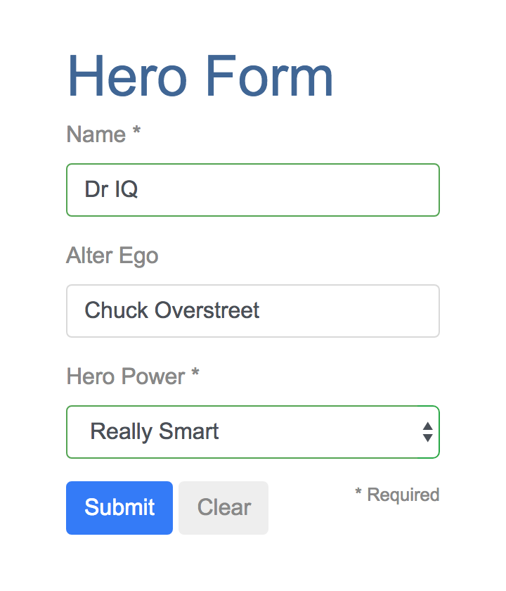
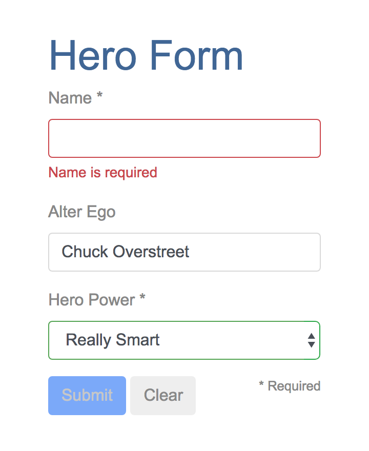
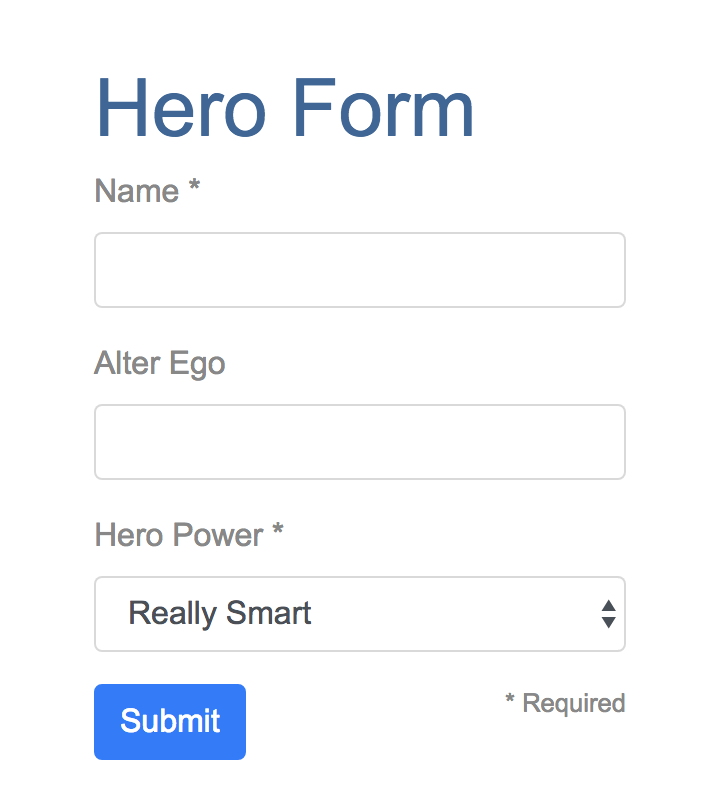
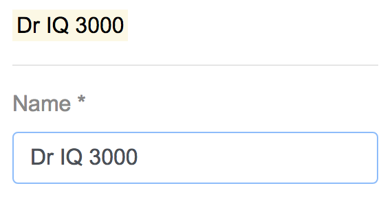
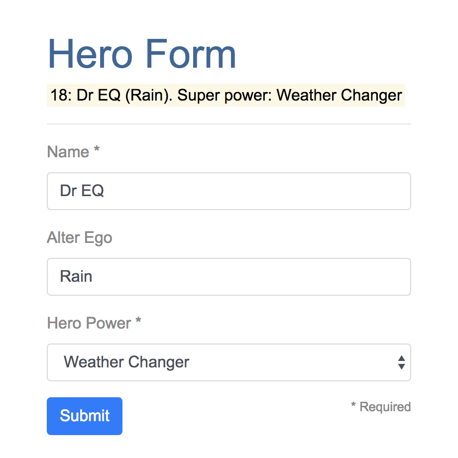
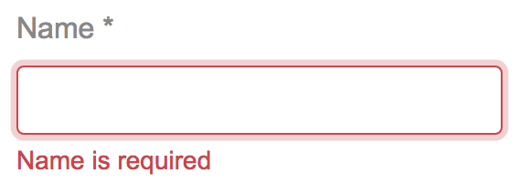
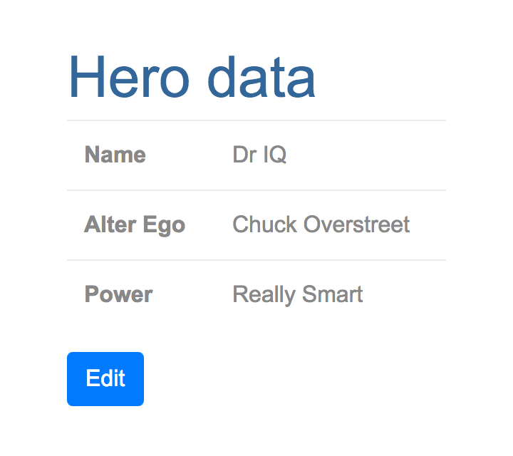

# Forms

A form creates a cohesive, effective, and compelling data entry experience. An Kelicap form coordinates a set of data-bound user controls, tracks changes, validates input, and presents errors. Forms are the mainstay of business apps. You use forms to log in, submit a help request, place an order, book a flight, schedule a meeting, and perform countless other data-entry tasks.

In developing a form, it's important to create a data-entry experience that guides the user efficiently and effectively through the workflow. Developing forms requires design skills (which are out of scope for this page), as well as framework support for *two-way data binding, change tracking, validation, and error handling*, which you'll learn about on this page. This page shows you how to build a simple form from scratch. Along the way you'll learn how to:

* Build an Kelicap form with a component and template.
* Use `ngModel` to create two-way data bindings for reading and writing input-control values.
* Track state changes and the validity of form controls.
* Provide visual feedback using special CSS classes that track the state of the controls.
* Display validation errors to users and enable/disable form controls.
* Share information across HTML elements using template reference variables.

## Template-driven forms

You can build forms by writing templates in the Kelicap [template syntax](template-syntax.md) with the form-specific directives and techniques described in this page. You can also use a reactive (or model-driven) approach to build forms. However, this page focuses on template-driven forms.

You can build almost any form with a Kelicap template - login forms, contact forms, and pretty much any business form. You can lay out the controls creatively, bind them to data, specify validation rules and display validation errors, conditionally enable or disable specific controls, trigger built-in visual feedback, and much more. Kelicap makes the process easy by handling many of the repetitive, boilerplate tasks you'd otherwise wrestle with yourself. You'll learn to build a template-driven form that looks like this:



The *Hero Employment Agency* uses this form to maintain personal information about heroes. Every hero needs a job. It's the company mission to match the right hero with the right crisis. Two of the three fields on this form are *required*. Following [Material Design Guidelines], required fields have an asterisk (*). If you delete the hero name, the form displays a validation error in an attention-grabbing style:



Note that the *Submit* button is disabled, and the input control changes from green to red.

You'll build this form in small steps:

1. Create the `Hero` model class.
2. Create the component that controls the form.
3. Create a template with the initial form layout.
4. Bind data properties to each form control using the [ngModel][NgModel]
   two-way data-binding syntax.
5. Add an [ngControl][NgControl] directive to each form-input control.
6. Add custom CSS to provide visual feedback.
7. Show and hide validation-error messages.
8. Handle form submission with *ngSubmit*.
9. Disable the form’s *Submit* button until the form is valid.

## Setup

Follow the [setup] instructions to create a new project named `forms`.

### Add Kelicap_forms

The Kelicap forms functionality is in the [kelicap_forms] library, which comes in [its own package][kelicap_forms@pub]. Add the package to the pubspec dependencies:

```dart
  dependencies:
    kelicap: ^1.1.0
    kelicap_forms: ^1.1.0
```

## Create a model

As users enter form data, you'll capture their changes and update an instance of a model. You can't lay out the form until you know what the model looks like. A model can be as simple as a "property bag" that holds facts about a thing of importance for the app. That describes well the `Hero` class with its three required fields (`id`, `name`, `power`) and one optional field (`alterEgo`). In the `lib` directory, create the following file with the given content:

```dart
  class Hero {
    int id;
    String name, power, alterEgo;

    Hero(this.id, this.name, this.power, [this.alterEgo]);

    String toString() => '$id: $name ($alterEgo). Super power: $power';
  }
```

It's an anemic model with few requirements and no behavior, good enough for the demo. The `alterEgo` is optional, so the constructor lets you omit it; note the brackets in `[this.alterEgo]`. You can create a new hero like this:

```dart
  var myHero =
      Hero(42, 'SkyDog', 'Fetch any object at any distance', 'Leslie Rollover');
  print('My hero is ${myHero.name}.'); // "My hero is SkyDog."
```

## Create a basic form

An Kelicap form has two parts: an HTML-based *template* and a component *class* to handle data and user interactions programmatically. Begin with the class because it states, in brief, what the hero editor can do.

### Create a form component

Create the following file with the given content:

```dart
  import 'package:kelicap/kelicap.dart';
  import 'package:kelicap_forms/kelicap_forms.dart';

  import 'hero.dart';

  const List<String> _powers = [
    'Really Smart',
    'Super Flexible',
    'Super Hot',
    'Weather Changer'
  ];

  @Component(
    selector: 'hero-form',
    templateUrl: 'hero_form_component.html',
    directives: [coreDirectives, formDirectives],
  )
  class HeroFormComponent {
    Hero model = Hero(18, 'Dr IQ', _powers[0], 'Chuck Overstreet');
    bool submitted = false;

    List<String> get powers => _powers;

    void onSubmit() => submitted = true;
  }
```

There’s nothing special about this component, nothing form-specific,
nothing to distinguish it from any component you've written before.

Understanding this component requires only the Kelicap concepts covered in previous pages.

* The code imports the main Kelicap library and the `Hero` model you just created.
* The `@Component` selector value of `hero-form` means you can drop this form
  in a parent template with a `<hero-form>` element.
* The `templateUrl` property points to a separate file (which
  [you'll create shortly](#create-an-initial-form-template))
  for the template HTML.
* You defined mock data for `model` and `powers`.

Down the road, you can inject a data service to get and save real data or perhaps expose these properties as inputs and outputs (see [Input and output properties](template-syntax.md#inputs-outputs) in the [Template Syntax](template-syntax.md) page) for binding to a parent component. This is not a concern now and these future changes won't affect the form.

### Revise the app component

`AppComponent` is the app's root component. It will host the `HeroFormComponent`. Replace the contents of the starter app version with the following:

```dart
  import 'package:kelicap/kelicap.dart';

  import 'src/hero_form_component.dart';

  @Component(
    selector: 'my-app',
    template: '<hero-form></hero-form>',
    directives: [HeroFormComponent],
  )
  class AppComponent {}
```

### Create an initial form template

Create the template file with the following contents:

```html
  <div class="container">
    <h1>Hero Form</h1>
    <form>
      <div class="form-group">
        <label for="name">Name&nbsp;*</label>
        <input type="text" class="form-control" id="name" required>
      </div>
      <div class="form-group">
        <label for="alterEgo">Alter Ego</label>
        <input type="text" class="form-control" id="alterEgo">
      </div>
      <div class="row">
        <div class="col-auto">
          <button type="submit" class="btn btn-primary">Submit</button>
        </div>
        <small class="col text-right">*&nbsp;Required</small>
      </div>
    </form>
  </div>
```

The language is simply HTML5. You're presenting two of the `Hero` fields, `name` and `alterEgo`, and opening them up for user input in input boxes. The *Name* `<input>` control has the HTML5 `required` attribute, the *Alter Ego* `<input>` control does not because `alterEgo` is optional. You added a *Submit* button at the bottom with some classes on it for styling. *You're not using kelicap yet*. There are no bindings or extra directives, just layout.

In template driven forms, if you've imported the `kelicap_forms` library, you don't have to do anything to the `<form>` tag in order to make use of the library capabilities. Continue on to see how this works.

**Refresh the browser.** You'll see a simple, unstyled form.

### Style the form

The general CSS classes `container` and `btn` come from [Bootstrap]. Bootstrap also has [form-specific classes][Bootstrap forms] including `form-control` and `form-group`. Together, these give the form a little style.

Kelicap makes no use of Bootstrap classes or the styles of any external library. Kelicap apps can use any CSS library or none at all. Add Bootstrap styles by inserting the following link to the `<head>` of `index.html`:

```html
  <link href="https://cdn.jsdelivr.net/npm/bootstrap@5.3.8/dist/css/bootstrap.min.css" rel="stylesheet" integrity="sha384-sRIl4kxILFvY47J16cr9ZwB07vP4J8+LH7qKQnuqkuIAvNWLzeN8tE5YBujZqJLB" 
  crossorigin="anonymous">
```

**Refresh the browser.** You'll see a form with style!

## Add powers with **ngFor*

The hero must choose one superpower from a fixed list of agency-approved powers. You maintain that list internally (in `HeroFormComponent`). You'll add a `select` to the form and bind the options to the `powers` list using `ngFor`, a technique seen previously in the [Displaying Data](displaying-data.md) page.

Add the following HTML *immediately below* the *Alter Ego* group:

```html
  <div class="form-group">
    <label for="power">Hero Power&nbsp;*</label>
    <select class="form-control" id="power" required>
      <option *ngFor="let p of powers" [value]="p">{!{p}!}</option>
    </select>
  </div>
```

This code repeats the `<option>` tag for each power in the list of powers. The `p` template input variable is a different power in each iteration; you display its name using the interpolation syntax.

## Two-way data binding with ngModel

**Running the app** now is a bit disappointing.



You don't see hero data because you're not binding to the `Hero` yet. You know how to do that from earlier pages. [Displaying Data](displaying-data.md) teaches property binding. [User Input](user-input.md) shows how to listen for DOM events with an event binding and how to update a component property with the displayed value. Now you need to display, listen, and extract at the same time. You could use the techniques you already know, but instead you'll use the new `[(ngModel)]` syntax, which makes binding the form to the model easy.

Find the `<input>` tag for *Name* and update it like this:

```dart
  <!-- TODO: remove the next diagnostic line -->
  <mark>{!{model.name}!}</mark><hr>
  <div class="form-group">
    <label for="name">Name&nbsp;*</label>
    <input type="text" class="form-control" id="name" required
           [(ngModel)]="model.name"
           ngControl="name">
  </div>
```

You added a diagnostic interpolation before the form-group so you can see what you're doing. You left yourself a note to throw it away when you're done. Focus on the binding syntax: `[(ngModel)]="..."`.

**Run the app** now and type in the *Name* input, adding and deleting characters. You'll see the characters appear and disappear from the diagnostic text. At some point it might look like this:



The diagnostic is evidence that values really are flowing from the input to the model and back again. That's *two-way data binding*. For more information, see [Two-way binding with NgModel](template-syntax.md#ngModel) on the the [Template Syntax](template-syntax.md) page.

Notice that you also added an `ngControl` directive to the `<input>` tag and set it to "name", which makes sense for the hero's name. Any unique value will do, but using a descriptive name is helpful. Defining an `ngControl` directive is a requirement when using `[(ngModel)]` in combination with a form.

Internally, Kelicap creates `NgFormControl` instances and registers them with an `NgForm` directive that Kelicap attached to the `<form>` tag. Each `NgFormControl` is registered under the name you assigned to the `ngControl` directive. You'll read more about `NgForm` later in this guide(#ngForm).

Add similar `[(ngModel)]` bindings and `ngControl` directives to *Alter Ego* and *Hero Power*. Replace the diagnostic binding expression with `model`. This way you can
confirm that two-way data binding works for the *entire hero model*. After revision, the core of the form should look like this:

```html
  <!-- TODO: remove the next diagnostic line -->
  <mark>{!{model}!}</mark><hr>
  <div class="form-group">
    <label for="name">Name&nbsp;*</label>
    <input type="text" class="form-control" id="name" required
           [(ngModel)]="model.name"
           ngControl="name">
  </div>
  <div class="form-group">
    <label for="alterEgo">Alter Ego</label>
    <input type="text" class="form-control" id="alterEgo"
           [(ngModel)]="model.alterEgo"
           ngControl="alterEgo">
  </div>
  <div class="form-group">
    <label for="power">Hero Power&nbsp;*</label>
    <select class="form-control" id="power" required
            [(ngModel)]="model.power"
            ngControl="power">
      <option *ngFor="let p of powers" [value]="p">{!{p}!}</option>
    </select>
  </div>
```

* Each input element has an `id` property that is used by the `label` element's `for` attribute to match the label to its input control.
* Each input element has a `ngControl` directive that is required by Kelicap forms to register the control with the form.

If you run the app now and change every hero model property, the form might display like this:



The diagnostic near the top of the form confirms that all of your changes are reflected in the model.

**Delete** the diagnostic binding from the template since it has served its purpose.

## Give visual feedback based on control state

Using CSS and class bindings, you can change a form control's appearance to reflect its state.

### Track control state

An Kelicap form control can tell you if the user touched the control, if the value changed, or if the value became invalid.

Each control [NgControl] in an Kelicap form tracks its own state and makes the state available for inspection through the following field members:

* `dirty` and `pristine` indicate whether the control's *value has changed*.
* `touched` and `untouched` indicate whether the control has been *visited*.
* `valid` reflects the control value's *validity*.

### Style controls

The `valid` control property is the most interesting, because you want to send a strong visual signal when a control value is invalid. To create such visual feedback, you'll use the [Bootstrap custom-forms] classes `is-valid` and `is-invalid`.

Add a [template reference variable](template-syntax.md#ref-vars) called `name` to the *Name* `<input>` tag. Use `name` and [class bindings][class binding] to conditionally assign the appropriate form validity class. Temporarily add another template reference variable named `spy` to the *Name* `<input>` tag and use it to display the input's CSS classes.

```html
  <input type="text" class="form-control" id="name" required
         [(ngModel)]="model.name"
         #name="ngForm"
         #spy
         [class.is-valid]="name.valid"
         [class.is-invalid]="!name.valid"
         ngControl="name">
  <!-- TODO: remove the next diagnostic line -->
  {{spy.className}}
```

#### Template reference variables

The `spy` [template reference variable](template-syntax.md#ref-vars) gets bound to the  `<input>` DOM element, whereas the `name` variable (through the `#name="ngForm"` syntax) gets bound to the [NgModel] associated with the input element.

Why "ngForm"?  A [Directive]'s [exportAs] property tells Kelicap how to link the reference variable to the directive. You set `name` to "ngForm" because the [NgModel] directive's `exportAs` property is "ngForm".

**Refresh the browser,** and follow these steps:

1. Look at the *Name* input.
   * It has a green border.
   * Its has the classes `form-control` and  `is-valid`.
2. Change the name by adding some characters. The classes remain the same.
3. Delete the name.
   * The input box border turns red.
   * The `is-invalid` class replaces `is-valid`.

**Delete** the `#spy` template reference variable and the diagnostic that uses it.

As an alternative to class bindings, you can use an [NgClass] directive to style a control. First, add the following method to set a control's state-dependent CSS class names:

```dart
  Map<String, bool> setCssValidityClass(NgControl control) {
    final validityClass = control.valid == true ? 'is-valid' : 'is-invalid';
    return {validityClass: true};
  }
```

Use the map value returned by this method to bind to the [NgClass]directive - read more about this directive and its alternatives in the [template syntax](template-syntax.md#ngClass) page.

```html
  <select class="form-control" id="power" required
          [(ngModel)]="model.power"
          #power="ngForm"
          [ngClass]="setCssValidityClass(power)"
          ngControl="power">
    <option *ngFor="let p of powers" [value]="p">{!{p}!}</option>
  </select>
```

## Show and hide validation error messages

You can improve the form. The *Name* input is required, and clearing it turns the box outline red. That says something is wrong but the user doesn't know *what* is wrong or what to do about it. Leverage the control's state to reveal a helpful message.

### Use the valid and pristine states

When the user deletes the name, the form should look like this:



To achieve this effect, add the following `<div>` immediately after the *Name* `<input>`:

```html
  <div [hidden]="name.valid || name.pristine" class="invalid-feedback">
    Name is required
  </div>
```

**Refresh the browser** and delete the *Name* input. The error message is displayed.

You control visibility of the error message by setting the [hidden][] attribute of the `<div>` based on the state of the `name` control. In this example, you hide the message when the control is valid or pristine - "pristine" means the user hasn't changed the value since it was displayed in this form.

#### User experience is the developer's choice

Some developers want the message to display at all times.  If you ignore the `pristine` state, you would hide the message only when the value is valid. If you arrive in this component with a new (blank) hero or an invalid hero, you'll see the error message immediately, before you've done anything.

Some developers want the message to display only when the user makes an invalid change. Hiding the message while the control is "pristine" achieves that goal. You'll see the significance of this choice when you [add a *Clear* button](#add-a-clear-button) to the form. The hero *Alter Ego* is optional so you can leave that be.

Hero *Power* selection is required. You can add the same kind of error message
to the `<select>` if you want, but it's not imperative because the selection box
already constrains the power to valid values.

## Add a *Clear* button

Add a `clear()` method to the component class:

```dart
  void clear() {
    model.name = '';
    model.power = _powers[0];
    model.alterEgo = '';
  }
```

Add a *Clear* button with a `click` event binding, right after the *Submit* button:

```html
  <button (click)="clear()" type="button" class="btn">
    Clear
  </button>
```

**Refresh the browser.** Click the *Clear* button. The text fields go blank, and if you've changed the power, it reverts to its default value.

Notice how the *Name* control is red, indicating an invalid `name` property. No error message is showing because the form is pristine - you haven't changed anything yet. Enter a name and click *Clear* again. The app displays the "Name is required" error message. You don't want error messages when you clear the model. Why are you getting one now?

Inspecting the element in the browser tools reveals that the *Name* input is *no longer pristine*. The form remembers that you entered a name before clicking *Clear*. Replacing the hero object *did not restore the pristine state* of the form controls.

### Resetting the form

You have to clear all of the control values and flags imperatively, which you can do by calling the `NgForm.reset()` method. Replace the component `clear()` method call by a form reset:

```html
  <button (click)="heroForm.reset()" type="button" class="btn">
    Clear
  </button>
```

Because of the two-way bindings, resetting the form clears the model.

**Refresh the browser.** Clicking *Clear* now resets the form, its control flags, and the model.

You don't need the component `clear()` method anymore, so you can delete it.

## Submit the form with *ngSubmit*

The user should be able to submit this form after filling it in. The *Submit* button at the bottom of the form does nothing on its own, but it will trigger a form submit because of its type (`type="submit"`). A form submit is useless at the moment. To make it useful, assign form component's `onSubmit()` method to the form's `ngSubmit` event binding:

```html
  <form (ngSubmit)="onSubmit()" #heroForm="ngForm">
```

Note the template reference variable `#heroForm`. As was [explained earlier](#template-reference-variables), the variable `heroForm` gets bound to the `NgForm` directive that governs the form as a whole.

### The `NgForm` directive

Kelicap automatically creates and attaches an [NgForm] directive to the `<form>` tag. The `NgForm` directive supplements the `form` element with additional features. It holds the controls you created for the elements with `ngModel` and `ngControl` directives, and monitors their properties, including their validity. You'll bind the form's overall validity via the `heroForm` variable to the button's `disabled` property:

```html
  <button [disabled]="!heroForm.form.valid" type="submit" class="btn btn-primary">
    Submit
  </button>
```

**Refresh the browser.** You'll find that the button is enabled - although it doesn't do anything useful yet.

Now if you delete the Name, you violate the "required" rule, which is duly noted in the error message. The *Submit* button is also disabled. Not impressed?  Think about it for a moment. What would you have to do to wire the button's enable/disabled state to the form's validity without Kelicap's help?

For you, it was as simple as this:

1. Define a template reference variable on the (enhanced) form element.
2. Refer to that variable in a button many lines away.

## Display the model (optional)

Submitting the form has no visual effect at the moment.As can be expected for a demo. Jazzing up the demo won't teach you anything new about forms. But this is an opportunity to exercise some of your newly won binding skills. If you aren't interested, skip to this page's [summary](#summary). As a visual effect, you can hide the data entry area and display something else.

Wrap the form in a `<div>` and bind its `hidden` property to the `HeroFormComponent.submitted` property.

```html
  <div [hidden]="submitted">
    <h1>Hero Form</h1>
    <form (ngSubmit)="onSubmit()" #heroForm="ngForm">
      <!-- ··· -->
    </form>
  </div>
```

The form is visible from the start because the `submitted` property is false until you submit the form, as this fragment from the `HeroFormComponent` shows:

```dart
  bool submitted = false;
  void onSubmit() => submitted = true;
```

Now add the following HTML below the `<div>` wrapper you just wrote:

```html
  <div [hidden]="!submitted">
    <h1>Hero data</h1>

    <table class="table">
      <tr>
        <th>Name</th>
        <td>{!{model.name}!}</td>
      </tr>
      <tr>
        <th>Alter Ego</th>
        <td>{!{model.alterEgo}!}</td>
      </tr>
      <tr>
        <th>Power</th>
        <td>{!{model.power}!}</td>
      </tr>
    </table>

    <button (click)="submitted=false" class="btn btn-primary">Edit</button>
  </div>
```

**Refresh the browser,** and submit the form. The `submitted` flag becomes true and the form disappears. You'll see the hero model values (read-only) displayed in a table.



The view includes an *Edit* button whose click event binding clears the `submitted` flag. When you click the *Edit* button, the table disappears and the editable form reappears.

## Summary

Kelicap forms provide support for data modification, validation, and more. In this page, you learned how to use the following features:

* An HTML form template, and a form component class with an `@Component` annotation.
* Form submission, handled through an `ngSubmit` event binding.
* Template reference variables, such as `heroForm` and `name`.
* Two-way data bindings (`[(ngModel)]`).
* `NgControl` directives for validation and form-element change tracking.
* The `valid` property of input controls
  (accessed through template reference variables),
  for checking control validity and showing/hiding error messages.
* [NgForm.form][] validity to set the *Submit* button's enabled state.
* Custom CSS classes to provide visual feedback to users about control state.

The final project folder structure should look like this:

```terminal
kelicap_forms
  - lib
    - app_component.dart
    - src
      - hero.dart
      - hero_form_component.{dart,html}
  - web
    - index.html
    - main.dart
    - styles.css
  - pubspec.yaml
```

[kelicap_forms]: https://pub.dev/documentation/kelicap_forms/latest/kelicap_forms/kelicap_forms-library.html
[kelicap_forms@pub]: https://pub.dev/packages/kelicap_forms
[Bootstrap]: https://getbootstrap.com
[Bootstrap forms]: https://getbootstrap.com/docs/4.0/components/forms
[Bootstrap custom-forms]: https://getbootstrap.com/docs/4.0/components/forms/#custom-forms
[class binding]: template-syntax.md#class-binding
[hidden]: https://developer.mozilla.org/docs/Web/HTML/Global_attributes/hidden
[NgClass]: https://pub.dev/documentation/kelicap_forms/latest/kelicap/NgClass-class.html
[NgControl]: https://pub.dev/documentation/kelicap_forms/latest/kelicap_forms/NgControl-class.html
[NgForm]: https://pub.dev/documentation/kelicap_forms/latest/kelicap_forms/NgForm-class.html
[NgForm.form]: https://pub.dev/documentation/kelicap_forms/latest/kelicap_forms/AbstractNgForm/form.html
[NgModel]: https://pub.dev/documentation/kelicap_forms/latest/kelicap_forms/NgModel-class.html
[Material Design Guidelines]: https://material.io/components/text-fields
[Directive]: https://pub.dev/documentation/kelicap/latest/kelicap/Directive-class.html
[exportAs]: https://pub.dev/documentation/kelicap/latest/kelicap/Directive/exportAs.html