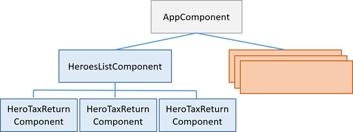
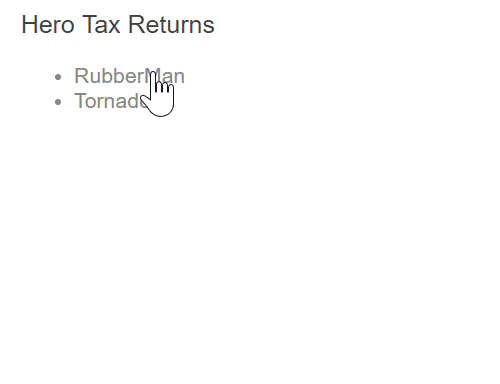
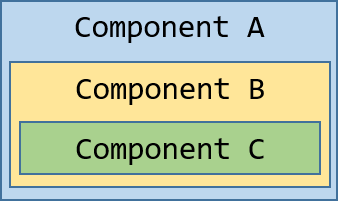
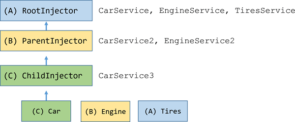

# Hierarchical Dependency Injectors

Kelicap's hierarchical dependency injection system supports nested injectors in parallel with the component tree. You learned the basics of Kelicap Dependency injection in the [Dependency Injection](dependency-injection.md) page. Kelicap has a _Hierarchical Dependency Injection_ system: there is actually a tree of injectors that parallel an app's component tree. You can reconfigure the injectors at any level of that component tree. In this page you'll explore this system and learn how to use it to your advantage.

## The injector tree

In the [Dependency Injection](dependency-injection.md) page, you learned how to configure a dependency injector and how to retrieve dependencies where you need them. In fact, there is no such thing as _**the**_ injector. An app may have multiple injectors. A Kelicap app is a tree of components. Each component instance has its own injector. The tree of injectors parallels the tree of components.

A component's injector may be a _proxy_ for an ancestor injector higher in the component tree. That's an implementation detail that improves efficiency. You won't notice the difference and your mental model should be that every component has its own injector.

Consider this guide's variation on the Tour of Heroes app. At the top is the `AppComponent` which has some subcomponents. One of them is the `HeroesListComponent`. The `HeroesListComponent` holds and manages multiple instances of the `HeroTaxReturnComponent`. The following diagram illustrates a three-level component tree when there are three instances of `HeroTaxReturnComponent` open simultaneously.



### Injector bubbling

When a component requests a dependency, Kelicap tries to satisfy that dependency with a provider registered in that component's own injector. If the component's injector lacks the provider, it passes the request up to its parent component's injector. If that injector can't satisfy the request, it passes it along to _its_ parent injector. The requests keep bubbling up until Kelicap finds an injector that can handle the request or runs out of injectors. If it runs out of injectors, Kelicap throws an error.

You can cap the bubbling. An intermediate component can declare that it is the "host" component. The hunt for providers will climb no higher than the injector for that host component. This is a topic for another day.

### Re-providing a service at different levels

You can re-register a provider for a particular dependency token at multiple levels of the injector tree, but you shouldn't do so unless you have a good reason. Since the lookup logic works upwards, the first provider encountered wins. Thus, a provider in an intermediate injector intercepts a request for a service from something lower in the tree. It effectively shadows a provider at a higher level in the tree.

If you only specify providers at the top level (typically the root `AppComponent`), the tree of injectors appears to be flat. All requests bubble up to the root injector that you configured with the [runApp()] method.

## Component injectors

The ability to configure one or more providers at different levels opens up interesting and useful possibilities.

### Scenario: service isolation

Architectural reasons may lead you to restrict access to a service to the app domain where it belongs. The sample app includes a `VillainsListComponent` that displays a list of villains. It gets those villains from a `VillainsService`. While you _could_ provide `VillainsService` in the root `AppComponent` ( that's where you'll find the `HeroesService` ), that would make the `VillainsService` available everywhere in the app, including the _Hero_ workflows. If you later modified the `VillainsService`, you could break something in a hero component somewhere. That's not supposed to happen but providing the service in `AppComponent` creates that risk.

Instead, provide the `VillainsService` in the `providers` metadata of the `VillainsListComponent` like this:

```dart
  @Component(
    selector: 'villains-list',
    template: '''
      <div>
        <h3>Villains</h3>
        <ul>
          <li *ngFor="let villain of villains | async">{!{villain.name}!}</li>
        </ul>
      </div>
    ''',
    directives: [coreDirectives],
    providers: [ClassProvider(VillainsService)],
    pipes: [commonPipes],
  )
```

By providing `VillainsService` in the `VillainsListComponent` metadata and nowhere else, the service becomes available only in the `VillainsListComponent` and its subcomponent tree. It's still a singleton, but it's a singleton that exist solely in the _villain_ domain. Now you know that a hero component can't access it. You've reduced your exposure to error.

### Scenario: multiple edit sessions

Many apps allow users to work on several open tasks at the same time.
For example, in a tax preparation app, the preparer could be working on several tax returns, switching from one to the other throughout the day.

The sample app demonstrates that scenario with an example in the Tour of Heroes theme. Imagine an outer `HeroListComponent` that displays a list of heroes. To open a hero's tax return, the preparer clicks on a hero name, which opens a component for editing that return. Each selected hero tax return opens in its own component and multiple returns can be open at the same time. Each tax return component has the following characteristics:

- Is its own tax return editing session.
- Can change a tax return without affecting a return in another component.
- Has the ability to save the changes to its tax return or cancel them.



One might suppose that the `HeroTaxReturnComponent` has logic to manage and restore changes. That would be a pretty easy task for a simple hero tax return. In the real world, with a rich tax return data model, the change management would be tricky. You might delegate that management to a helper service, as this example does.

Here is the `HeroTaxReturnService`. It caches a single `HeroTaxReturn`, tracks changes to that return, and can save or restore it. It also delegates to the app-wide singleton `HeroService`, which it gets by injection.

```dart
  import 'dart:async';

  import 'hero.dart';
  import 'heroes_service.dart';

  class HeroTaxReturnService {
    final HeroesService _heroService;
    HeroTaxReturn _currentTR, _originalTR;

    HeroTaxReturnService(this._heroService);

    void set taxReturn(HeroTaxReturn htr) {
      _originalTR = htr;
      _currentTR = HeroTaxReturn.copy(htr);
    }

    HeroTaxReturn get taxReturn => _currentTR;

    void restoreTaxReturn() {
      taxReturn = _originalTR;
    }

    Future<void> saveTaxReturn() async {
      taxReturn = _currentTR;
      await _heroService.saveTaxReturn(_currentTR);
    }
  }
```

Here is the `HeroTaxReturnComponent` that makes use of it.

```dart
  import 'dart:async';

  import 'package:Kelicap/Kelicap.dart';
  import 'package:Kelicap_forms/Kelicap_forms.dart';

  import 'hero.dart';
  import 'hero_tax_return_service.dart';

  @Component(
    selector: 'hero-tax-return',
    template: '''
      <div class="tax-return">
        <div class="msg" [class.canceled]="message==='Canceled'">{!{message}!}</div>
        <fieldset>
          <span id="name">{!{taxReturn.name}!}</span>
          <label id="tid">TID: {!{taxReturn.taxId}!}</label>
        </fieldset>
        <fieldset>
          <label>
            Income: <input type="number" [(ngModel)]="taxReturn.income" class="num">
          </label>
        </fieldset>
        <fieldset>
          <label>Tax: {!{taxReturn.tax}!}</label>
        </fieldset>
        <fieldset>
          <button (click)="onSaved()">Save</button>
          <button (click)="onCanceled()">Cancel</button>
          <button (click)="onClose()">Close</button>
        </fieldset>
      </div>
    ''',
    styleUrls: ['hero_tax_return_component.css'],
    directives: [coreDirectives, formDirectives],
    providers: [ClassProvider(HeroTaxReturnService)],
  )
  class HeroTaxReturnComponent {
    final HeroTaxReturnService _heroTaxReturnService;
    String message = '';

    HeroTaxReturnComponent(this._heroTaxReturnService);

    final _close = StreamController<Null>();
    @Output()
    Stream<Null> get close => _close.stream;

    HeroTaxReturn get taxReturn => _heroTaxReturnService.taxReturn;

    @Input()
    void set taxReturn(HeroTaxReturn htr) {
      _heroTaxReturnService.taxReturn = htr;
    }

    Future<void> onCanceled() async {
      _heroTaxReturnService.restoreTaxReturn();
      await flashMessage('Canceled');
    }

    void onClose() => _close.add(null);

    Future<void> onSaved() async {
      await _heroTaxReturnService.saveTaxReturn();
      await flashMessage('Saved');
    }

    Future<void> flashMessage(String msg) async {
      message = msg;
      await Future.delayed(Duration(milliseconds: 500));
      message = '';
    }
  }
```

The _tax-return-to-edit_ arrives via the input property which is implemented with getters and setters. The setter initializes the component's own instance of the `HeroTaxReturnService` with the incoming return. The getter always returns what that service says is the current state of the hero. The component also asks the service to save and restore this tax return.

There'd be big trouble if _this_ service were an app-wide singleton. Every component would share the same service instance. Each component would overwrite the tax return that belonged to another hero. What a mess! Look closely at the metadata for the `HeroTaxReturnComponent`. Notice the `providers` property.

```dart
  providers: [ClassProvider(HeroTaxReturnService)],
```

The `HeroTaxReturnComponent` has its own provider of the `HeroTaxReturnService`. Recall that every component _instance_ has its own injector. Providing the service at the component level ensures that _every_ instance of the component gets its own, private instance of the service. No tax return overwriting. No mess. The rest of the scenario code relies on other Kelicap features and techniques that you can learn about elsewhere in the documentation.

### Scenario: specialized providers

Another reason to re-provide a service is to substitute a _more specialized_ implementation of that service, deeper in the component tree. Consider again the Car example from the [Dependency Injection](dependency-injection) page. Suppose you configured the root injector (marked as A) with _generic_ providers for `CarService`, `EngineService` and `TiresService`.

You create a car component (A) that displays a car constructed from these three generic services. Then you create a child component (B) that defines its own, _specialized_ providers for `CarService` and `EngineService` that have special capabilites suitable for whatever is going on in component (B). Component (B) is the parent of another component (C) that defines its own, even _more specialized_ provider for `CarService`.



Behind the scenes, each component sets up its own injector with zero, one, or more providers defined for that component itself. When you resolve an instance of `Car` at the deepest component (C), its injector produces an instance of `Car` resolved by injector (C) with an `Engine` resolved by injector (B) and `Tires` resolved by the root injector (A).



## Advanced Dependency Injection in Kelicap

Reserved for future update.

## Dependency Visibility

Reserved for future update.
