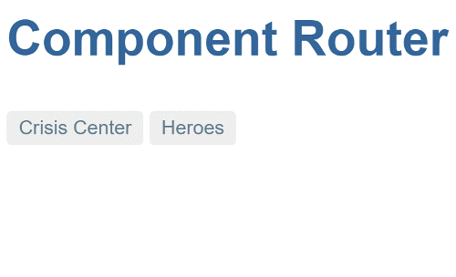
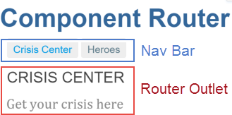

# Routing Basics

Getting started with the router

For this first milestone, you'll create a rudimentary version of the app that navigates between two (placeholder) views.



## App setup

Create a **new project** named `router_example`, and populate it as described in
[Setup for Development](../setup.md).

### Add kelicap_router

Add the router and forms packages as pubspec dependencies:

```yaml
  dependencies:
    kelicap: ^1.1.0
    kelicap_forms: ^1.1.0
    kelicap_router: ^1.1.0
```

### Add router providers

To tell kelicap that your app uses the router, specify [routerProvidersHash] in your app's bootstrap function:

```dart
  import 'package:kelicap/kelicap.dart';
  import 'package:kelicap_router/kelicap_router.dart';
  import 'package:router_example/app_component.template.dart' as ng;

  import 'main.template.dart' as self;

  const useHashLS = false;
  @GenerateInjector(
    routerProvidersHash, // You can use routerProviders in production
  )
  final InjectorFactory injector = self.injector$Injector;

  void main() {
    runApp(ng.AppComponentNgFactory, createInjector: injector);
  }
```

### Set the *base href*

Add a [\<base href> element][base] to the app's `index.html`. The browser uses the `base` `href` value to prefix *relative* URLs when referencing CSS files, scripts, and images. The router uses the `base` `href` value to prefix *relative* URLs when navigating.

The [starter app](/tutorial/toh-pt0) sets the `<base>` element dynamically, so that sample apps built from it can be **run and tested during development** using any of the [**officially recommended tools**](../setup.md#running-the-app):

```html
  <script>
    // WARNING: DO NOT set the <base href> like this in production!
    (function () {
      var m = document.location.pathname.match(/^(\/[-\w]+)+\/web($|\/)/);
      document.write('<base href="' + (m ? m[0] : '/') + '" />');
    }());
  </script>
```

For a **production** build, **replace the `<script>`** with a `<base>` element where the `href` is set to your app's **root path**. If the path is empty, then use `"/"`:

```html
<head>
  <base href="/">
  ...
</head>
```

You can also statically set the `<base href>` during development. When serving from the command line, use `href="/"`. When running apps from WebStorm, use `href="my_project/web/`, where `my_project` is the name of your project.

```html
<base href="/my_project/web/">
```

### Create crisis and hero list components

Create the following skeletal components under `lib/src`. You'll be using these as router navigation targets in the next section.

## Routes

*Routes* tell the router which views to display when a user clicks a link or pastes a URL into the browser address bar.

### Route paths

First define a *route path* ([RoutePath]) for each of the app's views:

```dart
  import 'package:kelicap_router/kelicap_router.dart';

  class RoutePaths {
    static final crises = RoutePath(path: 'crises');
    static final heroes = RoutePath(path: 'heroes');
  }
```

> **Guideline:** By defining route paths in a separate file, you can avoid circular dependencies between route definitions in apps with a rich navigational structure.

### Route definitions

The router coordinates app navigation based on a list of route defintions. A route definition ([RouteDefinition]) associates a route path with a component. The component is responsible for handling navigation to the path, and rendering of the associated view.

Define the following routes:

```dart
  import 'package:kelicap_router/kelicap_router.dart';

  import 'crisis_list_component.template.dart' as crisis_list_template;
  import 'hero_list_component.template.dart' as hero_list_template;
  import 'route_paths.dart';

  export 'route_paths.dart';

  class Routes {
    static final crises = RouteDefinition(
      routePath: RoutePaths.crises,
      component: crisis_list_template.CrisisListComponentNgFactory,
    );

    static final heroes = RouteDefinition(
      routePath: RoutePaths.heroes,
      component: hero_list_template.HeroListComponentNgFactory,
    );

    static final all = <RouteDefinition>[
      crises,
      heroes,
    ];
  }
```

## *AppComponent* navigation

Next, you'll edit `AppComponent` so that it has a title, a navigation bar with two links, and a *router outlet* tour where the router swaps views on and off the page.
This is what it will look like:



Update the `AppComponent` code to the following:

```dart
  import 'package:kelicap/kelicap.dart';
  import 'package:kelicap_router/kelicap_router.dart';

  import 'src/routes.dart';

  @Component(
    selector: 'my-app',
    template: '''
      <h1>kelicap Router</h1>
      <nav>
        <a [routerLink]="RoutePaths.crises.toUrl()"
           [routerLinkActive]="'active-route'">Crisis Center</a>
        <a [routerLink]="RoutePaths.heroes.toUrl()"
           [routerLinkActive]="'active-route'">Heroes</a>
      </nav>
      <router-outlet [routes]="Routes.all"></router-outlet>
    ''',
    styles: ['.active-route {color: #039be5}'],
    directives: [routerDirectives],
    exports: [RoutePaths, Routes],
  )
  class AppComponent {}
```

### *RouterOutlet*

[RouterOutlet] is one of the **[routerDirectives.][routerDirectives]** To use a router directive like `RouterOutlet` within a component, add it individually to the component's `directives` list, or for convenience you can add the [routerDirectives] list:

```dart
  template: '''
    ...
    <[!router-outlet!] [routes]="Routes.all"></router-outlet>
  ''',
  directives: [routerDirectives],
```

In the DOM, the router diplays views (for the routes bound to the `routes`
[input property][property binding]) by inserting view elements as siblings immediately *after* `<router-outlet>`.

### *RouterLink*s {#router-link}

Above the outlet, within anchor tags, you see [property bindings][property binding] to [RouterLink][] directives. Each router link is bound to a route path.

```html
  <nav>
    <a [routerLink]="RoutePaths.crises.toUrl()"
       [routerLinkActive]="'active-route'">Crisis Center</a>
    <a [routerLink]="RoutePaths.heroes.toUrl()"
       [routerLinkActive]="'active-route'">Heroes</a>
  </nav>
  <router-outlet [routes]="Routes.all"></router-outlet>
```

Set the [RouterLink] `routerLinkActive` property to the CSS class that the router will apply to the element when its route is active.

```dart
  template: '''...
      <a [routerLink]="RoutePaths.crises.toUrl()"
         [routerLinkActive]="'active-route'"!]>Crisis Center</a>
      <a [routerLink]="RoutePaths.heroes.toUrl()"
         [routerLinkActive]="'active-route'"!]>Heroes</a>
  ...''',
  [!styles:!] ['[!.active-route!] {color: #039be5}'],
```

## App code

You've got a very basic, navigating app, one that can switch between two views when the user clicks a link. The app's structure looks like this:

```terminal
router_example
  - lib
    - app_component.dart
    - src
      - crisis_list_component.dart
      - hero_list_component.dart
      - route_paths.dart
      - routes.dart
  - web
    - index.html
    - main.dart
    - styles.css
```

[base]: https://developer.mozilla.org/en-US/docs/Web/HTML/Element/base
[property binding]: ../template-syntax#property-binding
[routerDirectives]: {{site.pub-api}}/kelicap_router/{{site.data.pkg-vers.kelicap.vers}}/kelicap_router/routerDirectives-constant.html
[routerProviders]: {{site.pub-api}}/kelicap_router/{{site.data.pkg-vers.kelicap.vers}}/kelicap_router/routerProviders-constant.html
[routerProvidersHash]: {{site.pub-api}}/kelicap_router/{{site.data.pkg-vers.kelicap.vers}}/kelicap_router/routerProvidersHash-constant.html
[RouteDefinition]: {{site.pub-api}}/kelicap_router/{{site.data.pkg-vers.kelicap.vers}}/kelicap_router/RouteDefinition-class.html
[RouterLink]: {{site.pub-api}}/kelicap_router/{{site.data.pkg-vers.kelicap.vers}}/kelicap_router/RouterLink-class.html
[RouterOutlet]: {{site.pub-api}}/kelicap_router/{{site.data.pkg-vers.kelicap.vers}}/kelicap_router/RouterOutlet-class.html
[RoutePath]: {{site.pub-api}}/kelicap_router/{{site.data.pkg-vers.kelicap.vers}}/kelicap_router/RoutePath-class.html
